# Turning the conduit in a corner

> An **addon** to [Corrugated Pipe Clamp](README.md), not a standalone part. It glues onto
> the flange of a printed `conduit_40mm_mount` and takes all its mating dimensions from that
> preset.

The [`conduit_40mm_mount`](README.md#standard-size-presets) preset assumes the conduit
arrives **pointing at** its hole. Sometimes it does not. This is for one particular awkward
case, and the case is worth stating precisely because every dimension follows from it:

- The conduit comes out of the **side wall**, behind the cabinet, held by a
  `conduit_40mm_mount` whose Ø94 flange bears on that wall.
- It is cut off about 1 mm proud of the mount, and lies **hard against the cabinet's back
  panel** — so its axis is exactly its own radius, 20 mm, off that panel.
- It has to turn 90° and go straight in through the back panel, and there is almost no room
  to do it in.

```
   side wall
  |
  | Ø94 flange of the mount = the face we glue to
  |+--------------------+        ---
  ||                    |         |  flange radius   47
  ||  ===== cut conduit |         |
  ||                    |        -+- conduit axis
  ||                    |         |  conduit radius  20
  |+---------+----------+        ---
  ===========|==============  cabinet back panel
             v
         threaded stuss + nut, into the cabinet
```

Both parts below are **70 long × 67 tall × 94 wide**, and two of those three are not
choices. The height is the flange's radius plus the conduit's: 47 + 20 = 67, because the
panel cuts the flange off 20 mm below its centre. The width is the flange itself. Only the
length is free, and `outlet_x` sets it.

## Two answers

|  | [`corner_elbow.scad`](corner_elbow.scad) | [`corner_bend.scad`](corner_bend.scad) |
|---|---|---|
| shape | four blocks: plate, elbow, plate, stuss | one hulled chamber in a shell |
| channel | Ø34 throughout, opening to Ø41 at the stuss | Ø34 in, Ø41 out, wide in between |
| material | **43.8 cm³** | 46.8 cm³ |
| support, standing on the glue face | 11.2 cm² | **8.3 cm²** |
| support, standing on the neck | 40.6 cm² | 29.9 cm² |
| the cable's turn | a 20 mm radius elbow, R/D 0.6 | an open chamber, no tube to follow |

Pick the **elbow** if you want a part you can read: every surface belongs to one of four
blocks and the whole file is primitives. Pick the **chamber** if the cable is the binding
constraint — it gives the cable an open room to turn in instead of a tight tube.

Note the row that matters most is the same for both: **which face you stand it on when you
print it is worth three to four times more than which shape you chose.**

---

# The elbow — four blocks

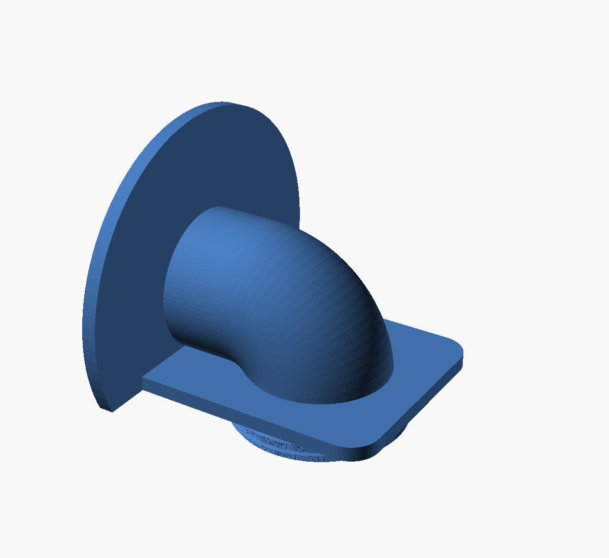

```
side   -- a round plate on the mount's Ø94 flange      (the glue face)
pipe   -- a 90° elbow, constant bore, nothing else
side   -- a squared plate on the cabinet's back panel  (the screw face)
screw  -- the threaded stuss + nut, unchanged
```

Two flat faces at 90° to each other, and the shortest tube that can join them. Nothing is
hulled, nothing is a wedge.

## The bend radius is not a choice

The elbow has to be tangent to the conduit going in and tangent to the panel coming out, and
the conduit's axis sits exactly its own radius — 20 mm — above that panel. So the centreline
radius is 20 mm, full stop:

```
bend_r = pipe_diameter / 2
```

There is no parameter for it and there should not be. The arc's centre lands *on* the back
panel, which is the only reason the turn closes in the height available.

## Why an elbow fits here at all

`corner_bend.scad` was built on the claim that it cannot — that a 20 mm arc is smaller than
the channel's own radius, so a swept tube would fold through itself. That is true of **its**
channel, which opens to Ø41 at the outlet. It is not true in general. The real condition is
on the tube's *outside*:

```
bore / 2 + wall  <=  pipe_diameter / 2        →   34/2 + 2.5 = 19.5  ≤  20   ✓
```

At Ø34 bore on a 2.5 mm wall the elbow clears by half a millimetre. And that same inequality
is the one that keeps the tube from standing proud of the back panel — satisfy it and both
are true at once, break it and both fail. It is a single assert in the model.

It only works because the channel takes the **conduit's bore, not its crest**: the conduit is
cut off at the flange, so nothing has to slide over it and the channel only has to carry what
the pipe carries. `bore` defaults to 34 mm — measure yours.

| Half-section: a 2.5 mm wall, the whole way round |
|:---:|
| 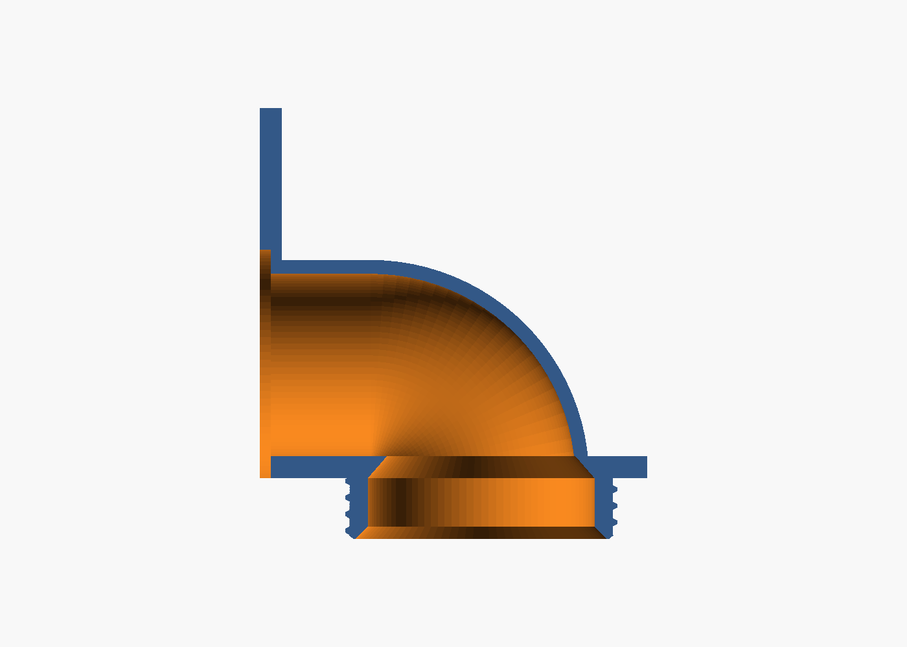 |

The inside of the turn is a Ø6 needle — R 20 on a Ø34 bore is R/D 0.6, which is tight. The
cable rides the outside of the bend, where the radius is 37. If that is too tight for the
cable you have, this is the wrong one of the two parts; take the chamber.

## The plates

The **glue plate** is a plain Ø94 disc, `glue_t` thick, cut off flat by the back panel. That
cut is what makes the part 67 mm tall. A recess in its face takes the 1 mm of conduit
standing proud of the mount.

The **panel plate** is squared, not round: at the same overhang past the hole it gives the
nut more ring to pull on, and it is the one face with nothing round to match. It runs all the
way back to the glue face rather than stopping at the bearing ring, and that last 10 mm pays
for itself twice — it makes the two faces one rigid **L** instead of two plates joined only
by a Ø39 tube, and when the part is printed standing on its glue face the plate then rises
straight off the bed instead of starting 10 mm up in mid-air. Leaving it off cost 1.7 cm² of
support and saved 1.3 cm³; not a good trade.

## Printing it

**Stand it on the glue face.** That is the orientation the shape is built for, and
`part = "print"` hands it to you already laid down:

```sh
openscad -o corner_elbow_print.stl -p corner_elbow.json -P corner_elbow_print corner_elbow.scad
```

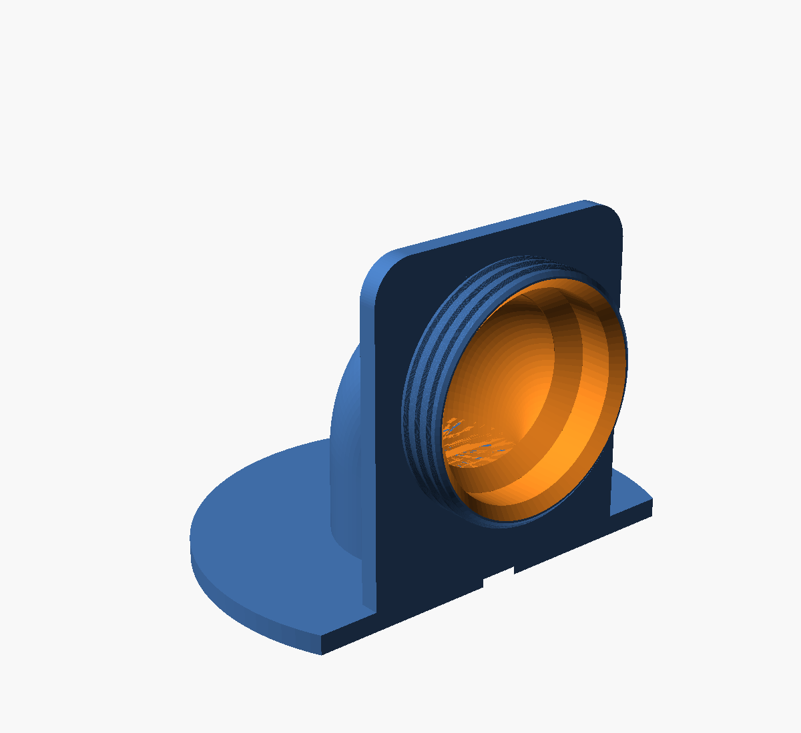

It is worth being concrete about why, because it is the single biggest decision here:

| standing on | flat on the bed | needs support |
|---|---|---|
| **the glue face** | 39.8 cm² | 11.2 cm² |
| the threaded neck | 0.6 cm² | 40.6 cm² |

Standing on the neck, the *entire* bottom face of the part floats 9 mm up on a Ø46 ring and
the slicer fills the whole footprint. Standing on the glue face, a Ø94 disc is welded to the
bed and almost everything else grows upward off it:

- the **elbow's inner surface is very nearly vertical** — because `bend_r` and the tube's
  outer radius are within half a millimetre of each other, the inside of the turn is a
  near-straight needle rather than an overhanging crown;
- the elbow's outer surface faces **upward** the whole way round the turn;
- both plates stand on edge.

What is left is about 11 cm², nearly all of it **inside the bore**: the annular seat that the
cut conduit butts against (a 3.4 mm ledge, bridges without noticing), and the crown of the
channel where it has turned horizontal and runs out into the stuss. That second one is just
the ordinary business of printing a horizontal Ø34 hole — the top droops a little over the
last few layers and closes. Neither is a surface anything bears on.

The one real cost is that **the thread ends up horizontal**. At 3 mm pitch on a Ø49 crest it
is coarse enough to survive that, and the nut is a separate print that still goes down flat.
If the thread matters more to you than the rest, print neck-down and accept the support under
the bottom face — that face beds against the panel, so check it with a straightedge after.

**The locator lip is off by default** (`locator_h = 0`). It has to stand 2.5 mm proud of the
glue face to reach the flange's rim, which is exactly the face you want on the bed — with the
lip on, the whole Ø94 glue face becomes a 2.5 mm overhang and support jumps to 53 cm². Once
the hole is drilled, the stuss locates the part anyway; the lip only helps hold it while the
glue goes off. `corner_elbow_lip` turns it on for a neck-down print.

## When the corner is tighter than 20 mm

Everything above assumes the conduit lies **on** the back panel, so its axis is exactly its
own radius off it and the part comes out 67 mm tall. That is the roomiest the corner can be,
and it is not always what the cabinet gives you. `panel_bite` drives the screw wall in:

```
panel_bite = 6      →   61 mm tall instead of 67
```

The elbow's round floor is simply sliced off at that plane, and the panel plate — which is
4 mm thick and wider than the tube — becomes the channel's floor. The channel stops being
round and becomes a **D**:

| | `panel_bite = 0` | `panel_bite = 6` | `+ open_floor` |
|---|---|---|---|
| height | 67 mm | **61 mm** | **61 mm** |
| the channel's floor is | our plate | our plate | the cabinet's panel |
| flat part of the floor | 11.5 mm | 27.5 mm | 19.3 mm |
| headroom above it | 33 mm | 27 mm | 31 mm |
| cross-section | 99 % of Ø34 round | 85 % | **96 %** |
| material | 44.0 cm³ | 40.1 cm³ | 38.7 cm³ |
| support, on the glue face | 11.3 cm² | 9.9 cm² | 9.6 cm² |

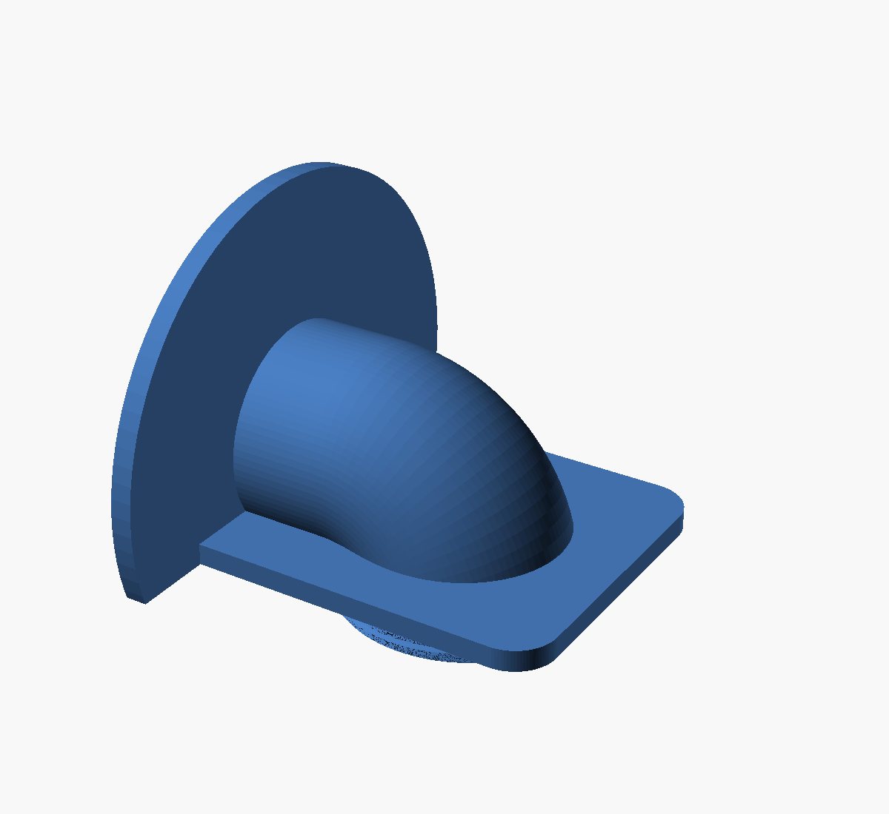

| Sliced 6 mm up: the elbow sits on the plate, and the plate is the floor |
|:---:|
| 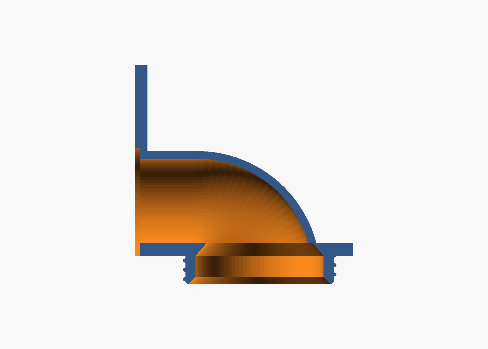 |

### The one thing the bite must not be allowed to do

The obvious way to build this is to let the bore keep cutting downward and come out through
the plate — "the channel can just be open, the cabinet's own panel closes it anyway". It
cannot. The channel's centreline runs 20 mm above the panel and the bore is Ø34, so at plate
level the cut is still 24 mm wide, and it runs from the glue face **straight into the bearing
ring**: at 15 mm from the wall it crosses the very annulus the nut pulls against. The screw
would be clamping a horseshoe.

So the channel is floored at the **top** of the plate instead. The plate stays a solid slab,
the bearing ring is a complete 4 mm collar all the way round the stuss, and the cable gets a
flat floor rather than an open slot — which is better than open, not worse.

| The underside: an unbroken bearing face round a complete thread |
|:---:|
|  |

That rule applies at `panel_bite = 0` too, and it is why the baseline part gained 0.2 cm³:
the bore used to nick a 1 mm groove through the bearing ring there as well. Small, but there
was no reason for it.

### `open_floor` — give the cross-section back, keep the ring

Flooring the channel on the plate costs 4 mm of depth, and 4 mm is 11 % of the bore's area.
`open_floor = true` takes it back: the bore is cut through the plate as well, so the cable
lies on the **cabinet's own back panel** and the channel returns to 96 % of round.

Everything the plate was doing for the channel is given up — except the one ring that cannot
be:

```openscad
difference() { pipe(bore, x0 = -1); screw_collar(); }   // cut everywhere but here
```

`screw_collar()` is the annulus from the edge of the Ø50 hole out to the edge of the plate,
Ø50 → Ø60, masked out of the cut and left whole at full plate thickness. The nut gets a
complete bearing ring; the rest of the plate goes.

The price is that the collar ends up standing 4 mm proud of an otherwise open floor, right
where the channel crosses it — **between 10 and 15 mm from the side wall**. So its outer edge
is chamfered at 45°: the cable rides up a ramp rather than meeting a square step. The chamfer
is on the top only; the bearing face underneath keeps its full 5 mm width. Over those few
millimetres the channel is locally back to the 85 % figure; everywhere else it is 96 %.

| Underside: the slot runs in from the wall and stops dead at the collar |
|:---:|
| 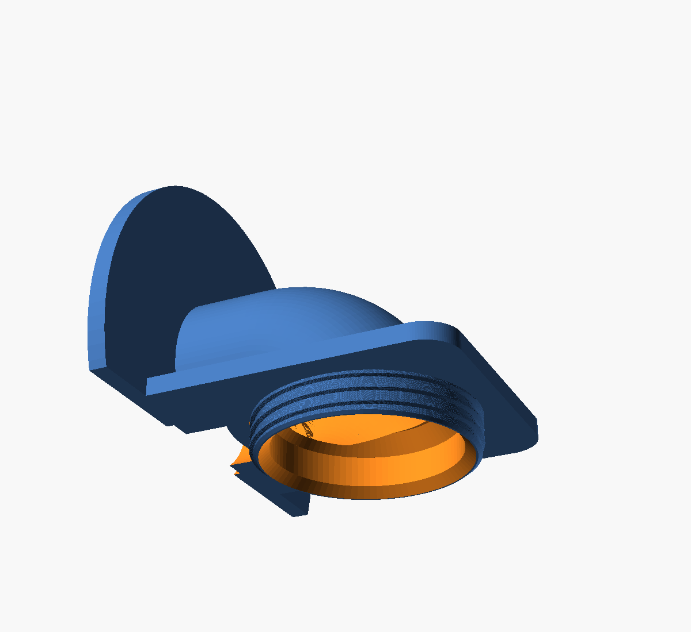 |

| Section: no plate under the channel, and the ramped collar at the left |
|:---:|
| 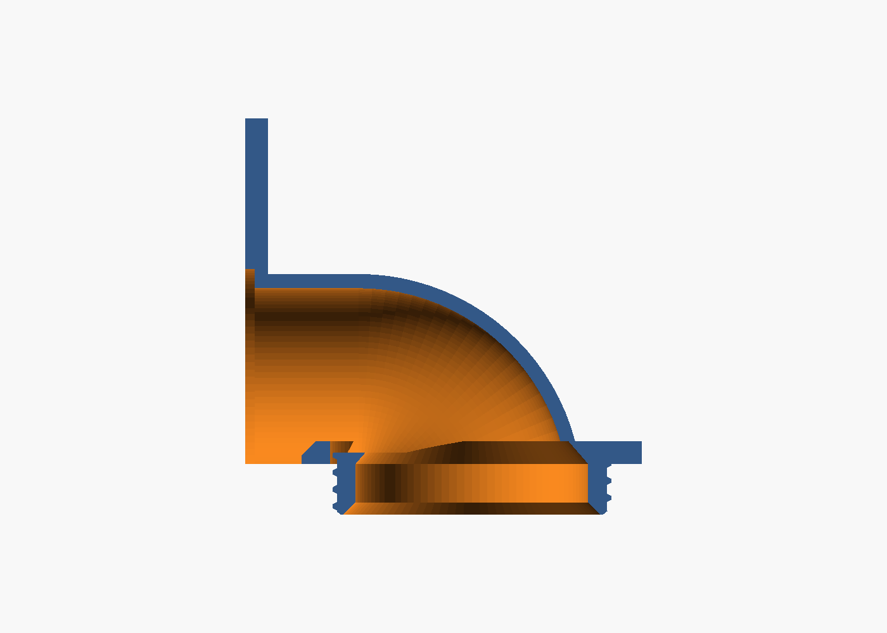 |

One thing to know if you check the model the way the rest of this repo does: this variant is
**genus 2**, not genus 1, and that is correct rather than a sliver. The collar is a closed
ring bridging a slot that is open at both sides, which is a second handle. Disable the collar
and it drops straight back to genus 1 — that is the check that tells the difference.

## The hole you have to drill

`outlet_x` sets where the new hole goes, and trades the part's length against how close to
the corner you have to drill. At the default it is **Ø50, centred 40 mm from the side wall,
so its near edge is 15 mm from the corner**. Everything is echoed on every render:

```
Overall: 70 long x 67 tall x 94 wide
Blocks: Ø94x4 glue plate | Ø39 elbow, 34 bore, R20 | 60 sq x 4 panel plate | Ø49.2 stuss
Elbow: 20 mm straight, then a 20 mm radius quarter turn -- R/D = 0.6
Tube clears the back panel by 0.5 mm; through the turn the cable rides between R3 inside and R37 outside
Hole centre sits 40 mm from the side wall -- its near edge is 15 mm from the corner
Panel plate overhangs the hole by 5 mm all round for the nut
```

The stuss carries 7 mm into the cabinet, where the fin-grip nut from the sibling project
[corrugated-pipe-bend](https://github.com/agjendem/corrugated-pipe-bend) clamps the panel
from inside. Thread and nut are cut from the *same* twisted solid grown by
`thread_clearance`, so they cannot mismatch.

## Presets

Named parameter sets live in [`corner_elbow.json`](corner_elbow.json):

| Preset | What it builds |
|---|---|
| `corner_elbow` | **the part** |
| `corner_elbow_print` | the same part, laid out on the bed for slicing |
| `corner_elbow_tight` | the screw wall driven 6 mm in — 61 mm tall, D-shaped channel |
| `corner_elbow_tight_print` | the same, laid out on the bed |
| `corner_elbow_tight_open` | and with the floor opened to the panel — 96 % of the bore back |
| `corner_elbow_tight_open_print` | the same, laid out on the bed |
| `corner_elbow_lip` | with the locator lip — print this one neck-down |
| `corner_elbow_nut` | the fin-grip nut |
| `corner_elbow_nut_wide` | the same nut with a bearing flange, for a thin plastic panel |
| `corner_elbow_hole60`, `corner_elbow_nut_hole60` | a Ø60 hole instead of Ø50 |

---

# The chamber — the first answer

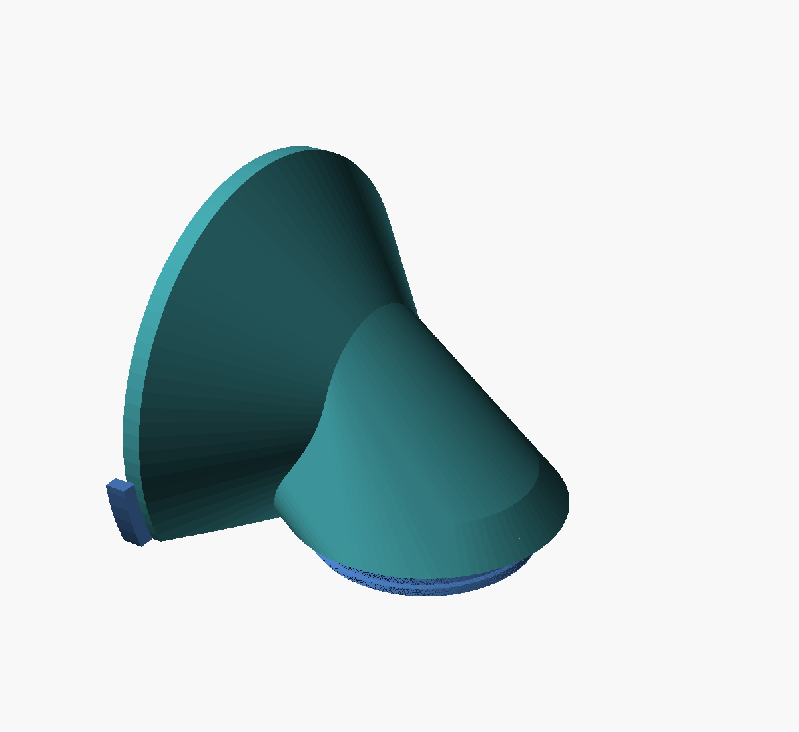

Same two faces, but the inside is not a tube: it is the **convex hull of the two ports**.
That surface is tangent to both, so the cable meets no edge anywhere — it comes in along the
inlet, rides the outside of the turn, and drops out of the outlet. It is simply the most open
shape that fits, which matters when the cable has just been given another 90° to get through.

| Half-section: the chamber, and the wall all the way round it |
|:---:|
| 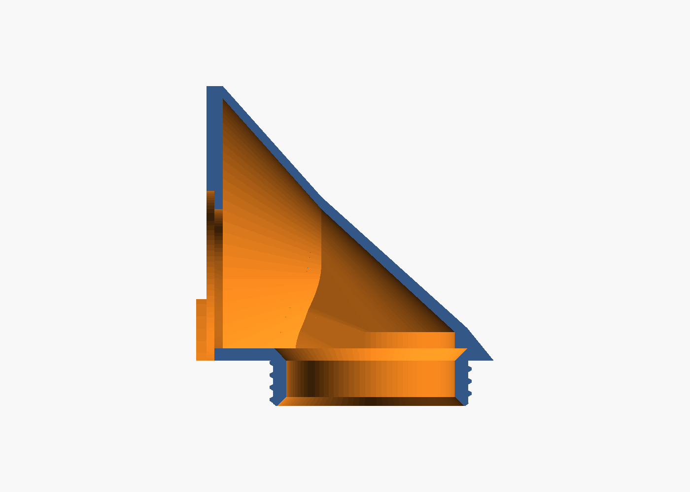 |

Two things in that section are the whole design, and both were wrong on the first attempt:

- **The floor does not converge.** The hull's natural underside runs from the inlet port's
  floor down to the outlet port's, which means it reaches the bottom face somewhere in
  between and breaks out through it. It is clipped flat at the inlet's own floor level
  instead, and the hole is funnelled into it.
- **The bottom face overhangs the hole by 5 mm all the way round**, so the nut has a ring of
  panel to clamp against. Size the outlet boss to the channel plus a wall and it comes out at
  0.6 mm — the nut would have nothing to pull on.

## A thin shell, not a solid wedge

Only three things here need to be substantial: the flange that takes the glue, the bearing
ring the nut pulls against, and a decent taper between them. Everything else is a **3 mm
shell** following the chamber.

Two hulls do it rather than one. Hulling the flange straight to the outlet — the obvious
thing — fills everything between them solid, which is a wedge of plastic doing no work at
all. Hulling the flange only as far as the tube gives the taper; hulling the tube to the
outlet gives the shell. The taper is hollow too: the cone from Ø94 down to the tube is big,
and left solid it is most of the part's mass for nothing, since the glue plate in front of it
is what carries the joint.

The two changes are worth about the same, and they compound:

| | solid taper | hollow taper |
|---|---|---|
| **solid wedge body** | 137.5 cm³ | 101.4 cm³ |
| **shell body** | 83.2 cm³ | **47.2 cm³** |

Along the inlet the shell comes out at exactly **Ø40** — the conduit's own outside diameter,
so it reads as the pipe carrying on, and it sits tangent to the back panel.

## How it locates itself

A lip wraps the flange's rim, along the **bottom** of the flange only, because that is where
the part can be wider without being taller: the 67 mm height is spoken for, the width is not.
It stops 0.5 mm short of the wall so it can never hold the glue face off its seat.

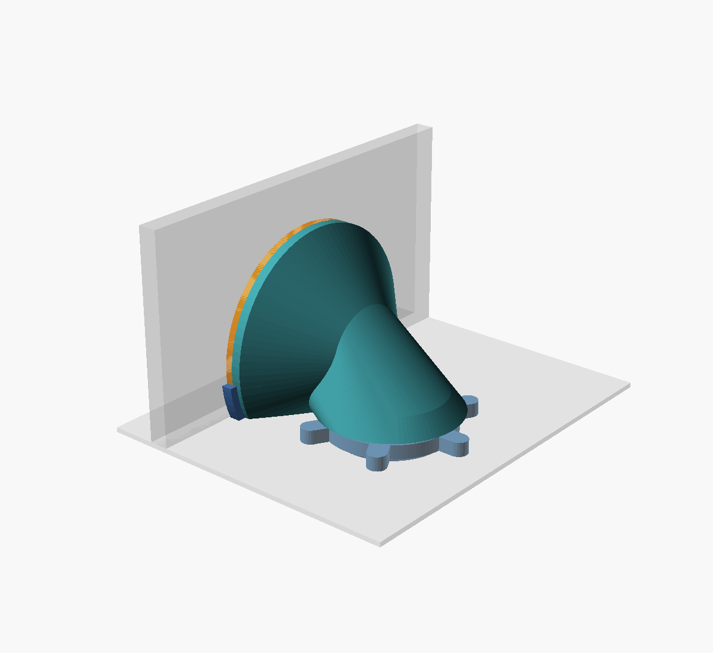

The flange (orange) and the side wall are ghosted in; the nut's fins show under the panel.

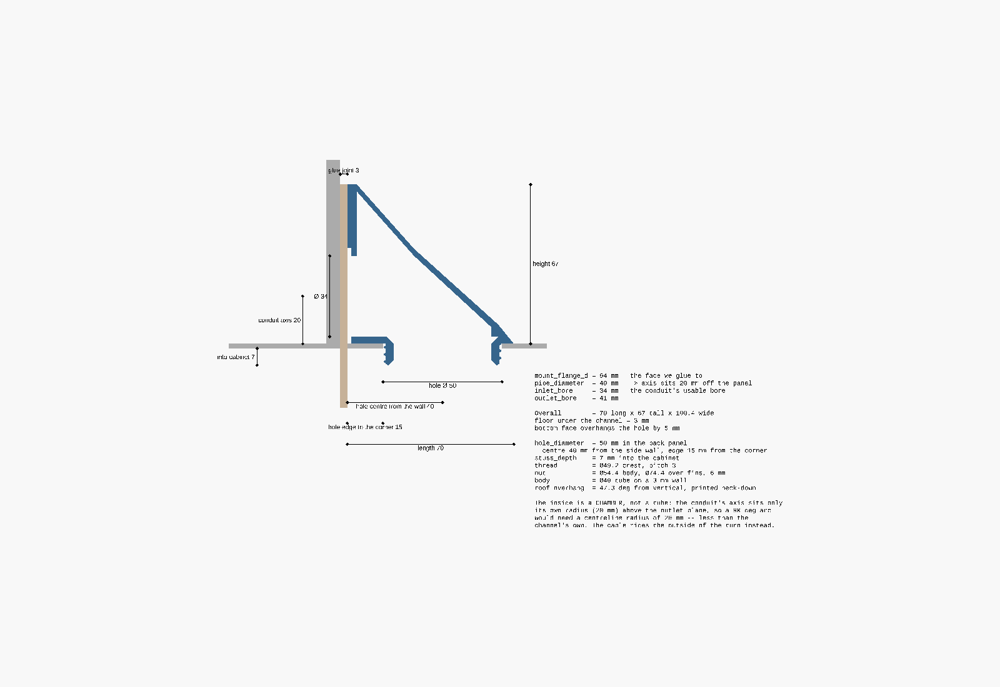

## Printing it

Exported as-is it stands on the tip of its threaded neck, which puts the thread vertical —
and the chamber's roof is tuned so that it carries itself in that orientation. That is what
`inlet_len` is really for: at the default 28 mm the roof stands at **47.3° from vertical**,
under the ~50° an FDM printer manages unaided, so there is no support inside the cavity,
which is where support is miserable to remove. The angle is echoed on every render with a
warning past 50°.

But the whole bottom face still floats 9 mm up on a Ø46 ring, and that costs **29.9 cm²** of
support. Rotate it onto its glue face instead (`rotate([0,-90,0])`, lip off) and the same
part needs **8.3 cm²** — the same lesson as the elbow, and it applies to a part you have
already printed.

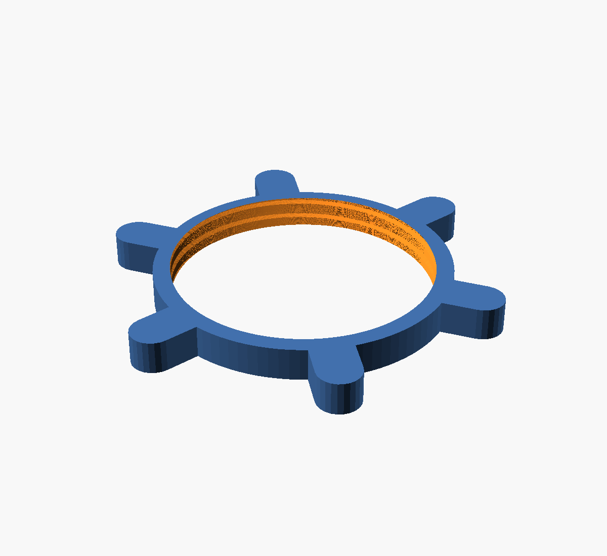

## Presets

Named parameter sets live in [`corner_bend.json`](corner_bend.json):

| Preset | What it builds |
|---|---|
| `corner_bend` | **the part, in one piece** |
| `corner_bend_nut` | the fin-grip nut |
| `corner_bend_nut_wide` | the same nut with a bearing flange, for a thin plastic panel |
| `corner_bend_hole60`, `corner_bend_nut_hole60` | a Ø60 hole instead of Ø50 — a roomier turn, 5 mm longer |

```sh
openscad -o corner_bend.stl -p corner_bend.json -P corner_bend corner_bend.scad
```
