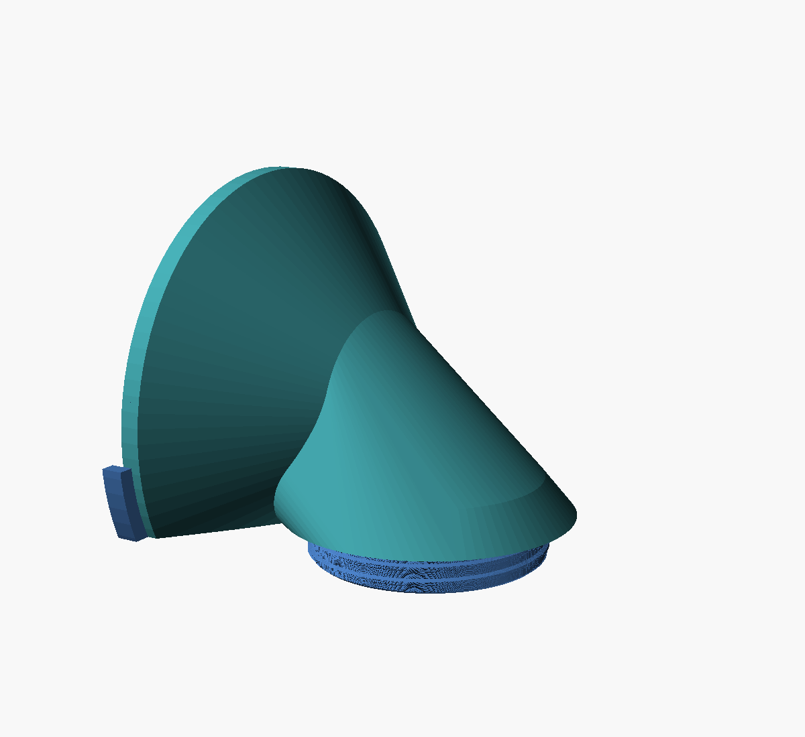

# Corner bend — turning the conduit in a corner

> An **addon** to [Corrugated Pipe Clamp](README.md), not a standalone part. It glues
> onto the flange of a printed `conduit_40mm_mount` and takes all its mating dimensions
> from that preset.

The [`conduit_40mm_mount`](README.md#standard-size-presets) preset assumes the conduit
arrives **pointing at** its hole.
Sometimes it does not. This addon is for one particular awkward case, and the case is worth
stating precisely because every dimension of the part follows from it:

- The conduit comes out of the **side wall**, behind the cabinet, held by a
  `conduit_40mm_mount` whose Ø94 flange bears on that wall.
- It is cut off about 1 mm proud of the mount, and lies **hard against the cabinet's back
  panel** — so its axis is exactly its own radius, 20 mm, off that panel.
- It has to turn 90° and go straight in through the back panel, and there is almost no room
  to do it in.

```
   side wall
  |
  | Ø94 flange of the mount = the face we glue to
  |+--------------------+        ---
  ||                    |         |  flange radius   47
  ||  ===== cut conduit |         |
  ||                    |        -+- conduit axis
  ||                    |         |  conduit radius  20
  |+---------+----------+        ---
  ===========|==============  cabinet back panel
             v
         threaded stuss + nut, into the cabinet
```

The part is **70 long × 67 tall × 100 wide**, and two of those three are not choices — they
are dictated by the picture. The height is the flange's radius plus the conduit's:
47 + 20 = 67, because the panel cuts the flange off 20 mm below its centre. The width is the
flange itself. Only the length is free, and `outlet_x` sets it.


## It is a chamber, not an elbow

The conduit's axis sits only its own radius above the outlet plane. A 90° arc between them
would need a centreline radius of 20 mm — **smaller than the channel's own radius**, so a
swept tube would fold through itself. There is no elbow that fits here, at any wall
thickness, and no amount of easing the curve helps.

So the inside is a chamber: the convex hull of the two ports. That surface is tangent to
both, so the cable meets no edge anywhere — it comes in along the inlet, rides the outside
of the turn, and drops out of the outlet. It is also simply the most open shape that fits,
which matters when the cable has just been given another 90° to get through.

| Half-section: the chamber, and the wall all the way round it |
|:---:|
|  |

Two things in that section are the whole design, and both were wrong on the first attempt:

- **The floor does not converge.** The hull's natural underside runs from the inlet port's
  floor down to the outlet port's, which means it reaches the bottom face somewhere in
  between and breaks out through it. It is clipped flat at the inlet's own floor level
  instead, and the hole is funnelled into it.
- **The bottom face overhangs the hole by 5 mm all the way round**, so the nut has a ring of
  panel to clamp against. Size the outlet boss to the channel plus a wall and it comes out
  at 0.6 mm — the nut would have nothing to pull on.

## A thin shell, not a solid wedge

Only three things here need to be substantial: the flange that takes the glue, the bearing
ring the nut pulls against, and a decent taper between them. Everything else is a **3 mm
shell** following the chamber.

Two hulls do it rather than one. Hulling the flange straight to the outlet — the obvious
thing — fills everything between them solid, which is a wedge of plastic doing no work at
all. Hulling the flange only as far as the tube gives the taper; hulling the tube to the
outlet gives the shell.

The taper is hollow too. The cone from Ø94 down to the tube is big, and left solid it is
most of the part's mass for nothing: the glue plate in front of it is what carries the
joint. So the cavity flares to match, `wall` inside the outer cone the whole way.

The two changes are worth about the same, and they compound:

| | solid taper | hollow taper |
|---|---|---|
| **solid wedge body** | 137.5 cm³ | 101.4 cm³ |
| **shell body** | 83.2 cm³ | **47.2 cm³** |

Along the inlet the shell comes out at exactly **Ø40** — the conduit's own outside diameter,
so it reads as the pipe carrying on, and it sits tangent to the back panel. That is not a
coincidence you can break: `inlet_bore + 2·wall` has to stay inside the conduit's radius or
the body would sit proud of the panel, and the model asserts it.

## The channel takes the conduit's bore, not its crest

Because the conduit is cut off at the flange, nothing has to slide over it: the channel only
has to carry what the pipe carries. `inlet_bore` defaults to **34 mm** — measure yours. It
matters more than it looks: at Ø34 there is 3 mm of floor left under the channel, and at the
Ø41.5 crest the channel would break clean out through the bottom face. The model asserts
rather than let that happen.

## How it locates itself

The back panel and the side wall between them fix everything except sliding along the wall —
and if it slides, it stops covering the flange. So a lip wraps the flange's rim. It runs
only along the **bottom** of the flange, because that is where the part can be wider without
being taller: the 67 mm height is spoken for, the width is not. It stops 0.5 mm short of the
wall so it can never hold the glue face off its seat.


The flange (orange) and the side wall are ghosted in; the nut's fins show under the panel.


## The hole you have to drill

`outlet_x` sets where the new hole goes in the back panel, and it trades three things off at
once — the part's length, how gentle the cable's turn is, and how close to the corner you
have to drill. At the default it is **Ø50, centred 40 mm from the side wall, so its near
edge is 15 mm from the corner**. Raising it further just makes the part longer. All three
numbers are echoed on every render:

```
Overall: 70 long x 67 tall x 100.4 wide
Conduit axis sits 20 mm off the panel; floor under the channel 3 mm
Channel: Ø34 in  ->  Ø41 out
Body: Ø40 tube on a 3 mm wall, flaring to Ø60 at the panel
Hole centre sits 40 mm from the side wall -- its near edge is 15 mm from the corner
Bottom face overhangs the hole by 5 mm for the nut to clamp
```

The stuss carries 7 mm into the cabinet, where the fin-grip nut from the sibling project
[corrugated-pipe-bend](https://github.com/agjendem/corrugated-pipe-bend) clamps the panel
from inside. Thread and nut are cut from the *same* twisted solid grown by
`thread_clearance`, so they cannot mismatch.

## Printing it

**One piece.** Nothing has to clamp around anything — the conduit is cut off at the flange,
so the part just slides on along its axis. Exported as-is it lands the right way up: it
stands on the tip of its threaded neck, which puts the thread vertical, the best orientation
it can have.



Two overhangs, and only one of them costs you anything:

- **Inside, the chamber's roof carries itself.** That is what `inlet_len` is really for: it
  sets where the roof starts, and so its slope. At the default 28 mm the roof stands at
  **47.3° from vertical** — under the ~50° an FDM printer manages unaided, so there is no
  support inside the cavity, which is where support is miserable to remove. Shorten
  `inlet_len` for a roomier chamber and the roof goes shallower; the angle is echoed on
  every render, with a warning past 50°.
- **Outside, the bottom face needs support.** It is a flat face 9 mm up (the neck's length),
  so the slicer fills the ring between the neck and the part's footprint. It comes off a
  flat face cleanly. That face beds against the back panel, so check it with a straightedge
  before fitting.

The neck's end is a Ø46 ring, which is not much of a footprint for a part this tall — but
the support under the bottom face lands on the bed too and steadies the whole thing. Use a
brim.


## Presets

Named parameter sets live in [`corner_bend.json`](corner_bend.json):

| Preset | What it builds |
|---|---|
| `corner_bend` | **the part, in one piece** |
| `corner_bend_nut` | the fin-grip nut |
| `corner_bend_nut_wide` | the same nut with a bearing flange, for a thin plastic panel |
| `corner_bend_hole60`, `corner_bend_nut_hole60` | a Ø60 hole instead of Ø50 — a roomier turn, 5 mm longer |

```sh
openscad -o corner_bend.stl -p corner_bend.json -P corner_bend corner_bend.scad
```
