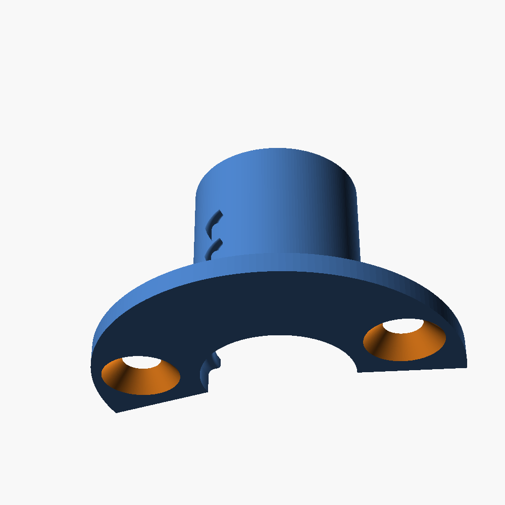
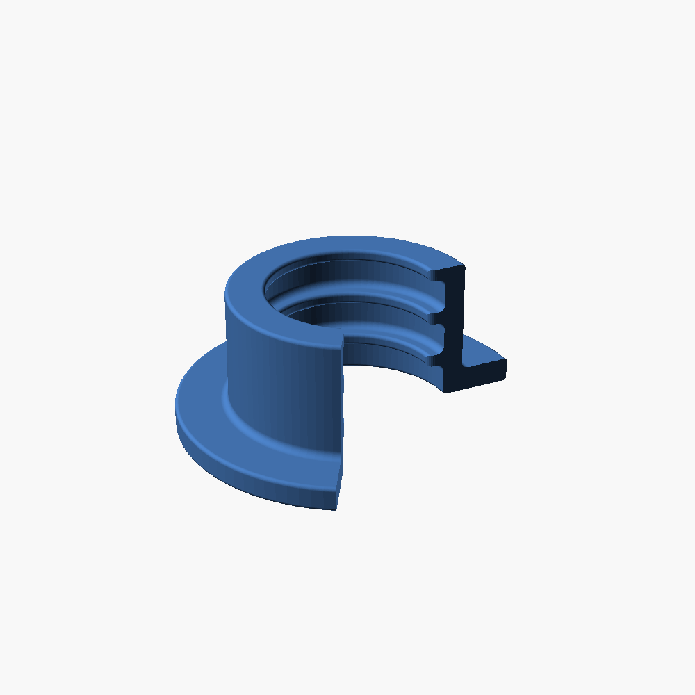
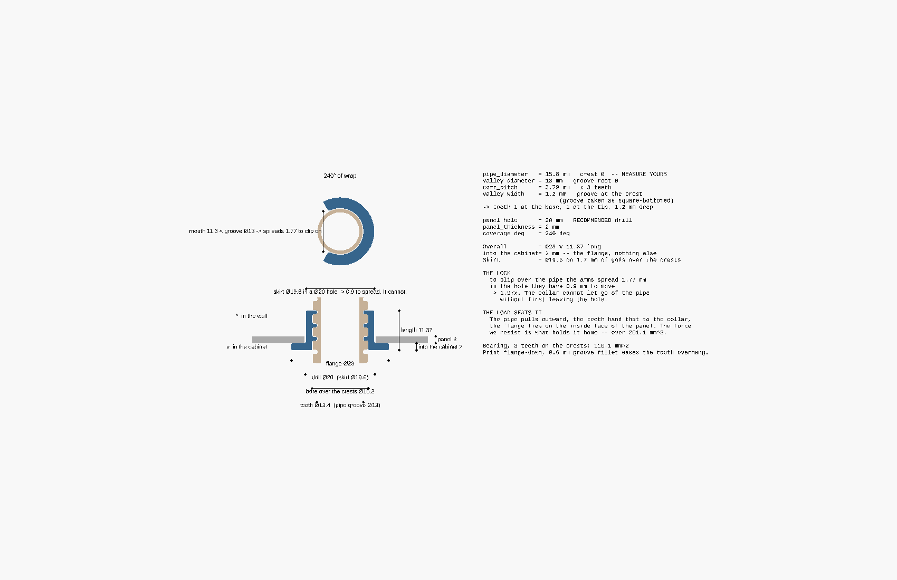
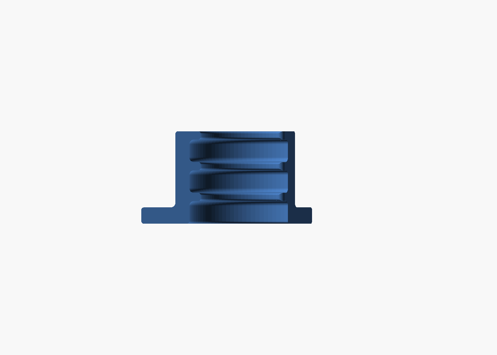
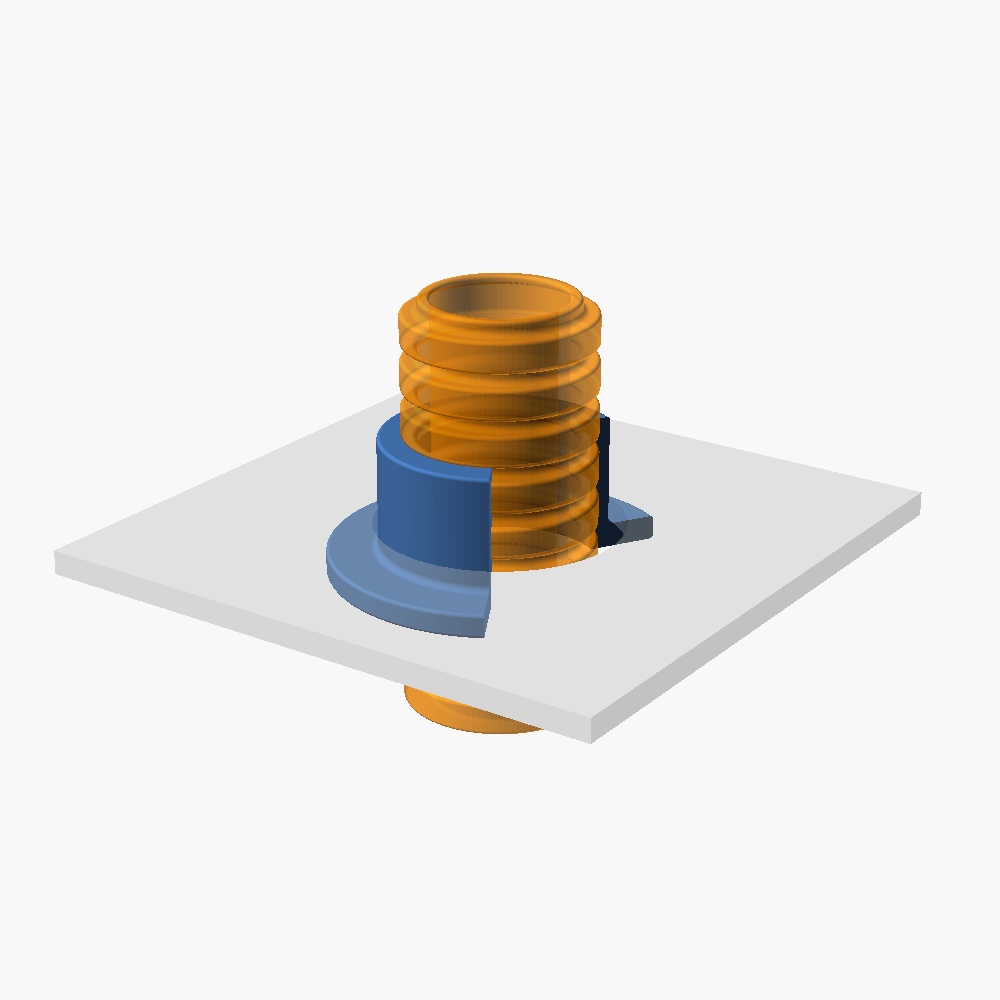
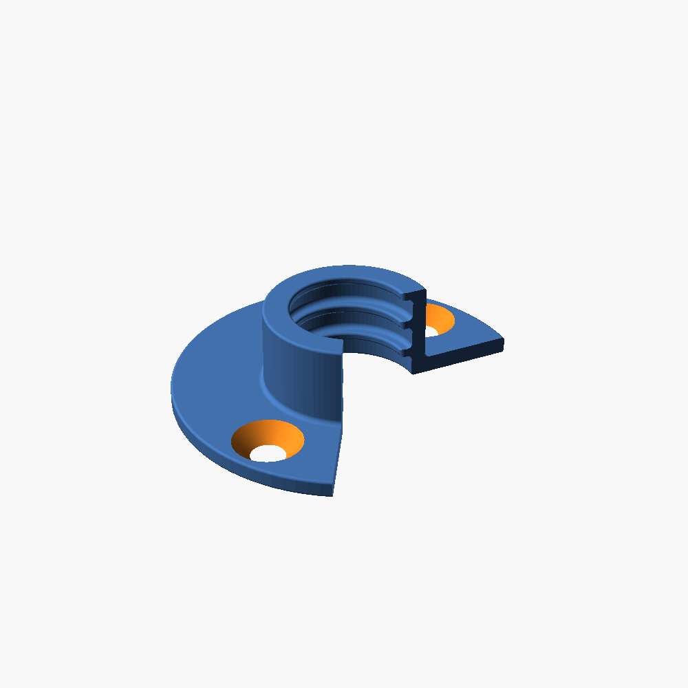
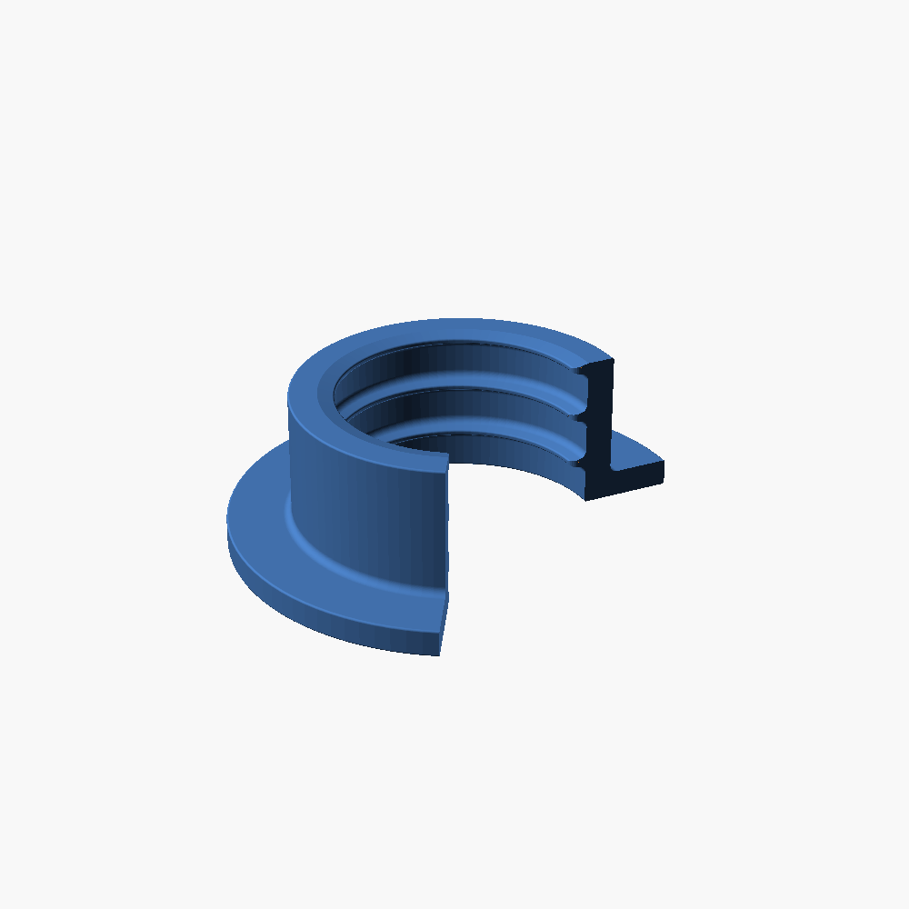
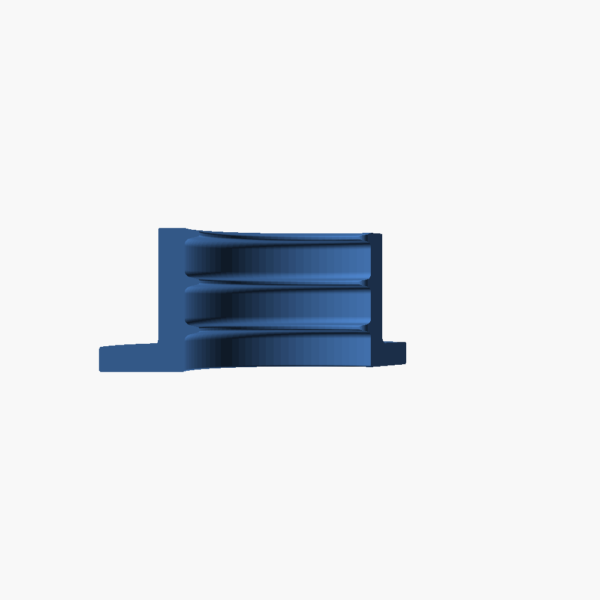
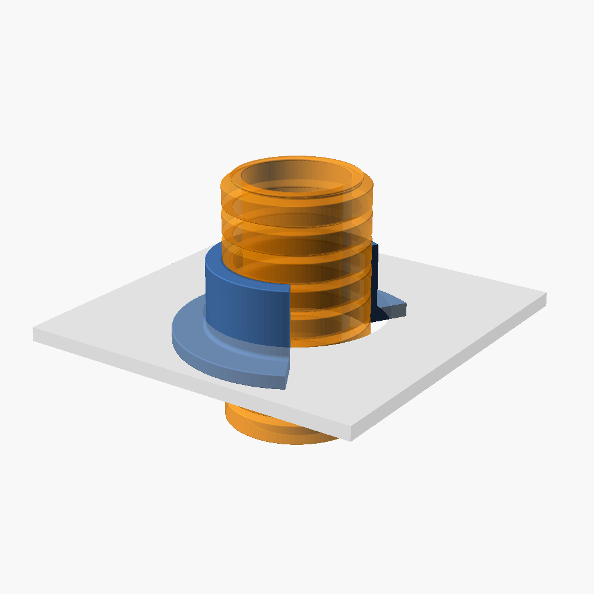
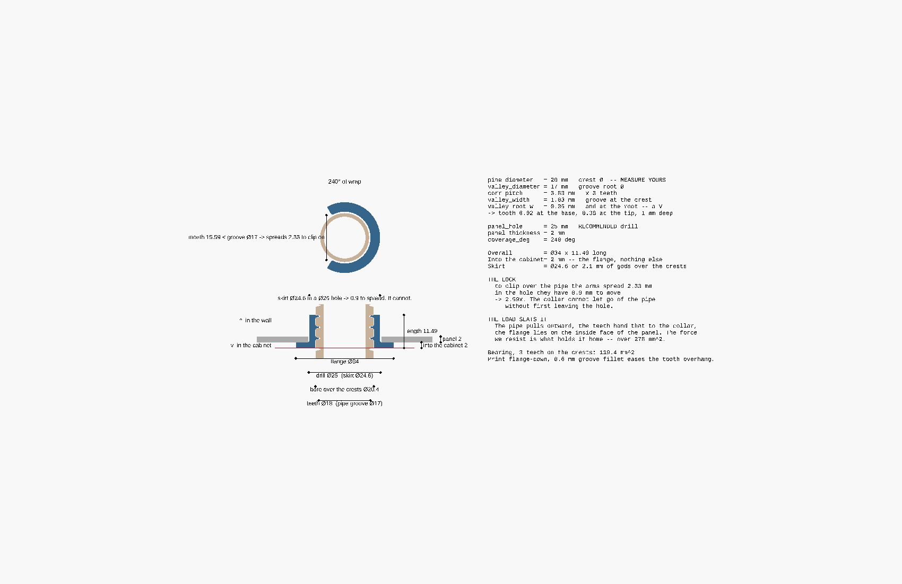

# Corrugated Pipe Clamp

A parametric, 3D-printable clamp that wraps **partially** around corrugated conduit
(electrical draw-in pipe). Internal circumferential teeth bite into the conduit's grooves
and **lock the pipe axially**, while a **flange** at one end is wider than the pipe so the
clamp + pipe cannot be pulled through a hole in a wall.

The whole model is defined in [`pipe_clamp.scad`](pipe_clamp.scad) using
[OpenSCAD](https://openscad.org/) — change the parameters at the top of the file and the
geometry updates automatically. All dimensions are in **millimetres**.

> If the pipe is **already** through the hole and cannot be threaded back out, you want
> [`snap_collar.scad`](snap_collar.scad) instead — it clips on sideways and builds 2 mm into
> the cabinet. See [Addon: cabinet snap collar](#addon-cabinet-snap-collar).

## Rendering example

All images below are rendered from the **default parameter values** in the
[parameter table](#parameters) further down — a "16 mm" conduit (crest Ø 15.8, valley Ø 13)
with 18 mm wall hole, 200° coverage, and a corrugation profile measured off a real pipe
(pitch 3.79 mm: 1.2 mm valley + 2.59 mm crest, 1.4 mm grip depth). Only the camera angle
differs between the 3D views.


This produces an arc covering ~200° of the pipe (open ~160° so it snaps on), with internal
circumferential grip teeth and a flange lip at one end. Computed result:

```
Available material (radial): 1.1 mm
Clamp body outer Ø: 18 mm     (= bore_diameter)
Flange Ø: 21.8 mm             (= pipe_diameter + 2·flange_overhang)
Length: 22.74 mm              (= corr_count · pitch = 6 · 3.79)
```

### Dimensioned drawing

A half-section with the sizes drawn straight onto it. Every value is generated from the
model's parameters by [`dimensions.scad`](dimensions.scad), so the drawing can never drift
from the geometry:


### More views

| Down the bore | Back (solid wrap) | Flange end |
|:---:|:---:|:---:|
|  |  |  |

All renders above (the 3D views and the dimensioned drawing) are regenerated by
[`render.sh`](render.sh). To export STLs for the standard conduit sizes, see
[Standard-size presets](#standard-size-presets) below.

## Parameters

| Parameter | Default | Meaning |
|---|---|---|
| `pipe_diameter` | `15.8` | Outer (crest) diameter of the corrugated conduit (mm) |
| `bore_diameter` | `18` | Hole the clamp passes through = clamp body outer Ø (mm) |
| `corr_depth` | `1.4` | How far the grip teeth bite into the conduit grooves (mm) |
| `corr_width` | `1.2` | Width of each grip tooth along the pipe axis (mm) |
| `groove_width` | `2.59` | Width of each recess (over a crest) along the axis (mm) |
| `corr_round` | `0.3` | Fillet radius on the convex tooth tips (mm); `0` = sharp tips |
| `groove_fillet` | `0.6` | Fillet radius in the concave groove bottoms (mm); eases the printed tooth-underside overhang. `0` = sharp corners |
| `corr_count` | `6` | Number of corrugation periods → sets the length |
| `coverage_deg` | `200` | Degrees of the pipe circumference covered |
| `flange_overhang` | `3` | How far the flange extends beyond the pipe width (mm) |
| `flange_thickness` | `1` | Flange thickness along the pipe axis (mm) |

### Sizing logic

You give the two diameters and the rest is **derived**:

- `pipe_diameter` is the conduit's outer (crest) diameter (e.g. 16 mm).
- `bore_diameter` is the hole the clamp must fit through — i.e. the clamp body's **outer
  diameter** (e.g. 18 mm).
- **Available material** (the smooth backing wall over the crests) =
  `(bore_diameter − pipe_diameter) / 2` (here 1 mm radial).
- The grip teeth bite `corr_depth` into the conduit's grooves (down to the valley), so the
  part is thicker at the teeth and thinnest (= available material) at the recesses.
- Real conduit crests and valleys are rounded/U-shaped rather than square, so two
  independent fillets soften the square-wave profile:
  - `corr_round` rounds the **convex tooth tips** (≤ half the smaller of
    `corr_width`/`groove_width`, and ≤ `corr_depth`).
  - `groove_fillet` rounds the **concave groove bottoms** — the downward-facing tooth
    undersides — which is the overhang that's hardest to 3D-print, so a larger radius here
    prints cleaner (≤ `corr_depth` and ≤ `groove_width`/2).
  Set either to `0` for sharp corners. Both limits are asserted in the model.
- Flange Ø = `pipe_diameter + 2·flange_overhang` (here 22 mm) — catches on the wall hole.
- Length = `corr_count · (corr_width + groove_width)` (always whole corrugation periods).
  The defaults were measured off a real "16 mm" conduit: crest Ø 15.8, valley Ø 13.0
  (→ `corr_depth` 1.4), 6 corrugations spanned 22.74 mm (pitch 3.79 mm = 1.2 valley + 2.59
  crest).

`bore_diameter` must be larger than `pipe_diameter` (asserted in the model). A coverage
above 180° gives a snap-fit grip onto the pipe.

## Conduit standard (IEC/EN 61386)

Electrical conduit is standardised by **IEC 61386** *"Conduit systems for cable
management"* (EN 61386 in Europe, NEK EN 61386 in Norway). Flexible/corrugated conduit is
covered by **part -22**. The **nominal size equals the outer (crest) diameter**, so set
`pipe_diameter` to a standard size:

| Nominal Ø (mm) | 16 | 20 | 25 | 32 | 40 | 50 | 63 |
|---|---|---|---|---|---|---|---|

16/20/25 mm are the common domestic sizes; the default model uses **16 mm**.

> ⚠️ **The standard fixes the nominal diameter, but *not* the corrugation depth or
> pitch** — these vary between makers and pipe types. Don't assume the defaults match your
> pipe; the defaults were measured off one specific "16 mm" conduit.

### How to measure your conduit

Use a caliper and set the parameters accordingly:

- `pipe_diameter` = the **crest** (outer) diameter.
- `corr_depth` = (crest Ø − valley Ø) / 2.
- pitch (`corr_width + groove_width`) = measure across **N** corrugations, divide by **N**.

## Usage

Open `pipe_clamp.scad` (or `corner_bend.scad`) in the OpenSCAD GUI to tweak parameters
live (they appear in the Customizer panel, grouped via `/* [Group] */` tags) and press
**F5** to preview.

### Export an STL from the command line

```sh
openscad -o pipe_clamp.stl pipe_clamp.scad
```

### Standard-size presets

Named parameter sets for the common IEC/EN 61386 conduit sizes live in
[`pipe_clamp.json`](pipe_clamp.json) (OpenSCAD Customizer presets — they appear in the
Customizer's preset dropdown in the GUI):

| Preset | `pipe_diameter` | `bore_diameter` | Notes |
|---|---|---|---|
| `conduit_16mm` | 16 | 18 | |
| `conduit_20mm` | 20 | 22 | |
| `conduit_25mm` | 25 | 27 | |
| `conduit_32mm` | 32 | 34 | |
| `conduit_40mm` | 40 | 42 | |
| `conduit_40mm_fittest` | 40 | 43 | 25° fit-test sliver, measured 40 mm pipe (3 mm deep teeth, no flange) |
| `conduit_40mm_mount` | 40 | 71 | 180° wall mount, measured 40 mm pipe; Ø71 bore, Ø94 flange (11.5 mm proud of the hole each side), 7 teeth, rounded grooves |
| `conduit_16mm_stud1` | 16 | 18 | Ø38 brim, **one** countersunk screw — anchors to a stud |
| `conduit_16mm_stud2` | 16 | 18 | the same with **two**, one each side |
| `conduit_40mm_mount_screws` | 40 | 71 | the Ø94 mount with two screws on a Ø82 circle |

The plain `conduit_*` presets only set the two diameters (bore = pipe + 2 mm) and inherit
the default corrugation/flange values — **adjust `corr_depth` and pitch to your actual
pipe** (see [How to measure your conduit](#how-to-measure-your-conduit)). The `_fittest`
preset shows the fuller pattern: a measured 40 mm conduit (crest 40, valley 34, pitch
5.33 = 4 mm crest + 1.33 mm valley) rendered as a narrow 25° arc to print-test the tooth
fit cheaply before committing to a full clamp.

The `_mount` preset is a thick-walled wall fitting: Ø71 bore (15.5 mm of solid wall over
the pipe), a Ø94 flange that catches on the wall hole, and 7 teeth (≈37.3 mm long).
Coverage is **180°**, so two identical parts wrap the pipe a full 360° — one STL, no
left/right handing, and each half prints flat without support. A half-shell does not snap
on by itself; it needs its mate (or a cable tie) to close around the pipe.

The teeth bite `corr_depth` 2.5 mm into the conduit's 3 mm-deep grooves, leaving 0.5 mm of
clearance at the valley bottom so the part seats without being forced.


| Down the bore | 3/4 view | Flange end |
|:---:|:---:|:---:|
|  |  |  |

### Anchoring the clamp to a stud

The flange is an end stop: it catches on the wall hole and stops the pipe being pulled
through. Widen it and put countersunk holes in it and it becomes a fixing instead — screwed
to a timber stud, the clamp holds the pipe **both ways** rather than only from pulling out,
and the hole it sits in no longer has to be any particular size.



The holes are in [`brim.scad`](brim.scad), shared with `snap_collar`, and sized for a 3.5 mm
gipsskrue: Ø4.0 clearance, Ø8.0 bugle head, 90° countersink — which is 2 mm deep, so the
flange has to be at least that thick (the default 1 mm is not, and the model says so).
`screw_count` is `0` by default; set it and the asserts will tell you how much wider the
flange has to be, and how far from the mouth the screws can sit.

Render one preset from the command line:

```sh
openscad -o clamp_16mm.stl -p pipe_clamp.json -P conduit_16mm pipe_clamp.scad
```

Or build an STL for **every** preset of **both** models into `stl/` at once:

```sh
./build.sh
```

### Re-render the README image

```sh
openscad -o images/pipe_clamp.png --imgsize=1000,1000 \
  --camera=0,0,9,55,0,25,95 --colorscheme=Tomorrow pipe_clamp.scad
```

## Addon: cabinet snap collar

`pipe_clamp` is a **through-hole** part: its outer diameter *is* the wall hole, so the pipe
has to be threaded through the hole before the clamp goes on. Sometimes the pipe is already
there — it comes through a drilled hole in the side of a low-voltage cabinet
("svakstrømsskap"), nothing holds it, and it can slide back out into the wall cavity.

[`snap_collar.scad`](snap_collar.scad) clips on **sideways** instead: a C of 240°, snapped
over the pipe and down into its grooves.



### Two things hold it, and neither is a screw

**The load seats it.** The pipe pulls *outward*; the teeth hand that load to the collar; the
collar's flange lies against the *inside* face of the panel. The very force being resisted
is what presses the part home — over 201 mm² of bearing. Inward is harmless. So nothing has
to latch, and everything except the flange lives in the hole and out in the wall:

```
   <- in the cabinet | panel | in the wall ->
   __________________|_______|_________________
  |     flange       | skirt |                 |
  |     Ø28          | Ø19.6 |                 |
  |__________________|__ ##__|_##____##________|   teeth, in the grooves
  - - - - - - - - - - - - - - - - - - - - - - -    centreline
  |      2 mm        |  2 mm |     7,4 mm      |
```

**2 mm of build height inside the cabinet**, which is usually all the room there is.

**The hole locks the C shut.** To clip over the pipe the arms must spread 1.77 mm. Once the
skirt is in the hole they have 0.9 mm to move in. The collar cannot let go of the pipe
without first leaving the hole, and it cannot leave the hole while the pipe is pulling it
against the panel:

| | mm |
|---|---|
| spread needed to clip over the pipe | **1.77** |
| room to spread, skirt inside the hole | **0.90** |
| → lock | **1.97×** |

That ratio is `assert`ed in the model — it is the whole design in one number. To remove the
collar: push the pipe further in (harmless), pull the collar out of the hole, unclip it.



| Down the bore | Cut in half | In the panel, on the pipe |
|:---:|:---:|:---:|
|  |  |  |

### Or screw it to a stud

Widen the brim a little, put countersunk holes in it, and the collar stops depending on the
hole at all — it anchors to a timber stud instead. That is not just a different way of
holding it, it changes what it can do:

| | holds the pipe |
|---|---|
| caught by the hole | **outward only** — inward is harmless, so nothing has to latch |
| screwed to a stud | **both ways**, and the hole can be any size |

 

One screw goes dead opposite the mouth, where the C is thickest and best supported. Two go
one to each side, at `screw_spread` degrees. Sized for a **3.5 mm gipsskrue** (30 mm is the
usual length): Ø4.0 clearance, Ø8.0 bugle head, 90° countersink.

> **The heads are on the skirt side.** This part is fitted the other way up from
> `pipe_clamp`: the brim's flat face is the one that bears, and the screws go in from the
> same side the teeth point. `pipe_clamp` has its heads on the opposite face, because its
> body goes *into* the hole it is screwed beside. `screw_head_at_skirt` flips it if you need
> the other hand.

**The brim stays 2 mm thick.** At those sizes the countersink is exactly 2 mm deep, so it
consumes the whole brim — which is how a countersunk hole in thin material works: there is
no flat land under the head, the cone *is* the bearing surface, 53 mm² of it. The brim is
only as wide as that cone plus about a millimetre:

| | r (mm) |
|---|---|
| body, incl. the fillet at the skirt root | 10.4 |
| screw head, inner edge | 11.5 |
| screw head, outer edge | 19.5 |
| brim edge | 20.5 |

So Ø41 instead of Ø28, and **the build height into the cabinet is unchanged at 2 mm**.

> The outermost millimetre of the brim is therefore a wedge, not a plate. Give it perimeters
> rather than infill, and do not drive the screw home hard — a bugle head will split a thin
> printed brim outward if you lean on it.

The same brim is available on `pipe_clamp` — see
[Anchoring the clamp to a stud](#anchoring-the-clamp-to-a-stud). `screw_count = 0` is the
default on both parts, so nothing changes unless you ask for it.

### Drill Ø20

For 16 mm conduit, **Ø20** is the recommendation and Ø18 does not work. A Ø18 hole on a
Ø15.8 crest leaves 1.1 mm of annulus *in total*; after clearances the skirt would be 0.7 mm
thick, and the model refuses it by name. Ø20 leaves 1.7 mm of gods over the crests.

`coverage_deg` has a narrow window and both ends are asserted: below ~235° the collar
neither holds the pipe nor gets locked by the hole, above ~290° there is no mouth left to
get the pipe in.

### 20 mm: the groove is not a slot

The 16 mm pipe measured here has a groove square enough to model as one. The 20 mm pipe does
not. Measured: five corrugations over 19.15 mm, crest 2.8 mm wide, and a groove that opens
about 1.0 mm at the crest and closes to roughly a third of that at the root — a U tending
towards a V.

A square tooth cut to the groove's mouth width **does not go in**. It is 0.83 mm wide and
the groove is only that wide 0.44 mm down, so it lands on the flanks near the top and stops
— less than half the intended bite. Rendered it looks perfect; on the pipe it grips like a
bump. Run the check below against such a tooth and 16 mm³ of it is inside the pipe, in six
rings hugging the groove walls from r 9.0 right out to the crest at r 10.0.

So the tooth tapers with the groove:

| | |
|---|---|
| `valley_width` | the groove's width **at the crest**, where it opens — 1.03 (pitch 3.83 − crest 2.8) |
| `valley_root_width` | its width **at the root**, down on `valley_diameter` — 0.35. `0` means square-bottomed, and every 16 mm preset leaves it there |
| `tooth_bite` | how far in past the crest the tooth reaches — 1.0, stopping 0.5 mm clear of the root |

Both ends of the tooth are read off the groove's own flank line, stepped back
`tooth_side_play`/2, so the clearance is 0.1 mm per side at *every* depth rather than
pinching at one corner. The tooth comes out 0.92 mm at the base and 0.38 mm at the tip. At
0.2 mm layers that tip is a ring two layers tall, not a thin wall — printable in this
orientation precisely because the taper runs along the axis.

**The wedge.** A sloped load face gives some of the pull back as a push outwards: 12.8° off
square here, so 22.7 % of whatever pulls the pipe is trying to cam the teeth out of the
grooves and spread the C. The hole was already there to stop the C spreading, and at Ø25 it
has 2.59× the margin it needs — so on this pipe the lock is doing two jobs, not one. If you
screw the brim to a stud instead, it does neither and the point is moot.



| Cut in half | On the pipe, in the panel |
|---|---|
|  |  |



**Pitch.** Three teeth means the pitch error piles up along the run: 0.1 mm per corrugation,
counting out from the middle tooth, before the outermost runs out of play. Measure over five
and divide — 19.15/5 = 3.83 — rather than measuring one. The model prints the tolerance it
has. A tapered tooth is forgiving here in a way a square one is not: off-pitch it seats a
little less deep instead of jamming.

### Checking a tooth against a pipe you measured

```sh
openscad --export-format asciistl -o /dev/null \
    -D 'part="fit"' -p snap_collar.json -P snap_collar_20mm snap_collar.scad
```

(`--export-format` is not optional here — OpenSCAD picks the exporter off the file suffix,
and `/dev/null` has none.)

`part = "fit"` intersects the collar with the modelled conduit. It must print **"Current top
level object is empty"**. Anything else is material the slicer will lay down inside the
groove, and the part will sit proud of the pipe by however thick it is.

This is in the dispatch because the eye cannot do it. A tooth that bottoms on the flanks of
a V looks right in every view — correct depth, correct width, seated — and the interference
is a wedge a tenth of a millimetre thick. Run it for every new pipe.

### Presets

| Preset | What |
|---|---|
| `snap_collar_16mm` | the default: pipe 15.8/13.0, pitch 3.79, Ø20 hole, 2 mm panel |
| `snap_collar_16mm_bend` | the *other* measured "16 mm" pipe — 16.0/14.0, pitch 3.372 |
| `snap_collar_16mm_4tooth` | four corrugations gripped instead of three |
| `snap_collar_16mm_fittest` | 2 teeth, no flange, no panel — ~1 g, print this first |
| `snap_collar_16mm_stud1` | Ø41 brim, **one** countersunk screw, opposite the mouth |
| `snap_collar_16mm_stud2` | Ø41 brim, **two**, one each side |
| `snap_collar_16mm_pipe` | a stub of the conduit itself, to test the clip on |
| `snap_collar_20mm` | **20 mm conduit, measured** — pitch 3.83, V groove 1.03 → 0.35, Ø25 hole |
| `snap_collar_20mm_fittest` | same pipe, 2 teeth, no flange — ~1 g, print this first |
| `snap_collar_20mm_stud2` | same pipe, Ø46 brim, two countersunk screws |
| `snap_collar_20mm_pipe` | a stub of the 20 mm conduit, V groove and all |

The two 16 mm presets differ because the two projects here measured two different "16 mm"
pipes — 15.8/13.0/3.79 in this one, 16.0/14.0/3.372 in
[corrugated-pipe-bend](https://github.com/agjendem/corrugated-pipe-bend). The standard fixes
the nominal diameter and nothing else, so **measure yours** (see
[How to measure your conduit](#how-to-measure-your-conduit)) and print
`snap_collar_16mm_fittest` before committing to a full part. Too tight: raise
`pipe_clearance` 0.2 at a time. Slides off sideways: raise `coverage_deg` 5° at a time. The
tooth bottoms out before it seats: raise `bottom_clearance`, or if the groove turns out to
be a V, say so with `valley_root_width` and cut `tooth_bite` — see
[20 mm: the groove is not a slot](#20-mm-the-groove-is-not-a-slot).

### Printing

**Flange down on the bed, axis vertical.** No support. The tooth undersides are the
overhang, which is exactly what `groove_fillet` is for, and the layers then lie
perpendicular to the way the arms bend — the strong direction for the snap, which is the
load the part meets every time it is clipped on. Pull-out is interlaminar shear at the tooth
roots, the weak direction, but the area is large — 110 mm² over the three teeth — so the
margin is enormous either way.

PETG or ASA (a wall cavity gets warm), 0.2 mm layers, 4 perimeters. PLA creeps under a
permanently loaded part and sits close to its strain limit during the clip-on.

### Shared libraries

Three things are needed by more than one part, so each lives in one file. None of them is a
part: no parameters of their own, nothing drawn at the top level, everything passed as
arguments.

| | |
|---|---|
| [`corrugation.scad`](corrugation.scad) | the corrugation profile — square or tapered — and its two fillet passes |
| [`brim.scad`](brim.scad) | countersunk screw holes in a flange |
| [`thread.scad`](thread.scad) | the threaded stuss and nut the corner parts share |

It also carries the bound that is easy to get wrong: a closing of radius *R* **seals** any
slot narrower than 2*R* rather than filleting it, and an opening of radius *R* **erases** any
rib thinner than 2*R*. The conduit's own groove is 1.2 mm wide, so the 0.6 mm fillet our much
wider recesses are happy with would fill the pipe's grooves in completely. `CORR_FILLET_MAX`
is the margin, and it is asserted.

The taper sharpens that second bound rather than adding a new one: a tooth you point is a rib
you thin, so it is the 0.38 mm **tip**, not the 0.92 mm base, that the opening pass has to
clear. Hence `corr_round` drops from 0.3 to 0.15 on the 20 mm preset, and the assert names
the number.

## Addon: corner bend

When the conduit arrives in a **corner** and cannot come at its hole straight on, three parts
here turn it 90° in the space available and hand it through the panel on a threaded stuss:
[`corner_elbow.scad`](corner_elbow.scad) (four blocks, the general case),
[`corner_elbow_clear.scad`](corner_elbow_clear.scad) (the same with nothing left in the
channel) and [`corner_bend.scad`](corner_bend.scad) (an open chamber). All three glue onto
the flange of a printed `conduit_40mm_mount` and are sized entirely off that preset.


Narrow, one-off sorts of part — the full story, and which to pick, is in
**[CORNER_BEND.md](CORNER_BEND.md)**.

## Requirements

- OpenSCAD (developed/verified with the 2026.04 snapshot/nightly build).
  - macOS: `brew install --cask openscad@snapshot`

## License

[MIT](LICENSE) © agjendem
