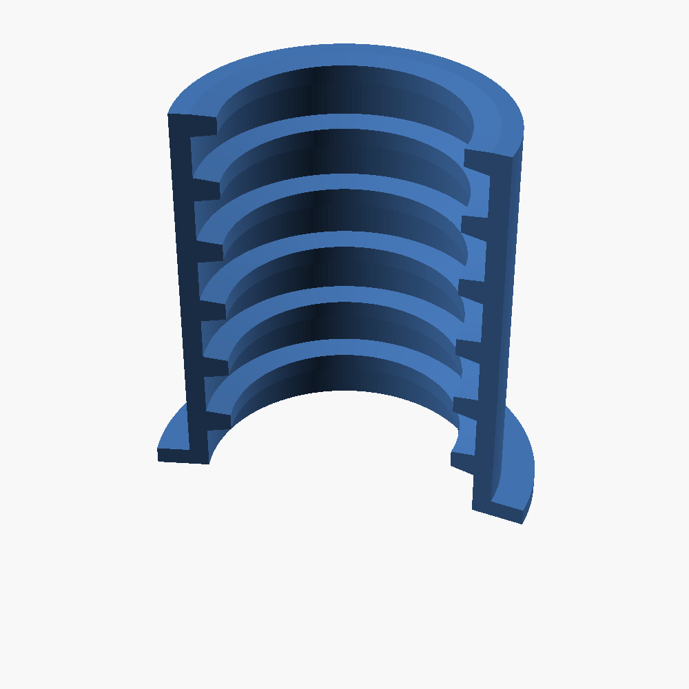
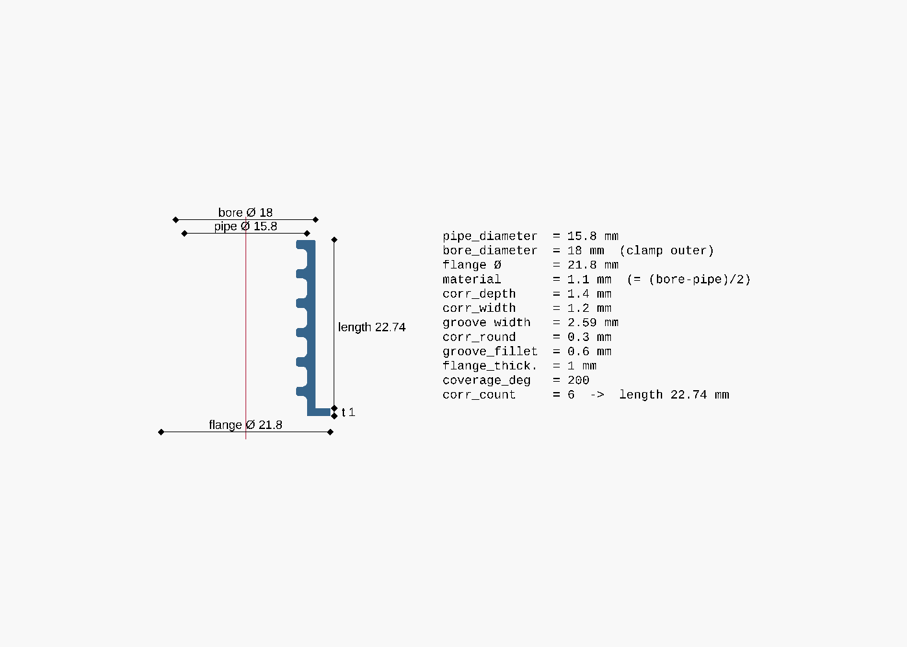
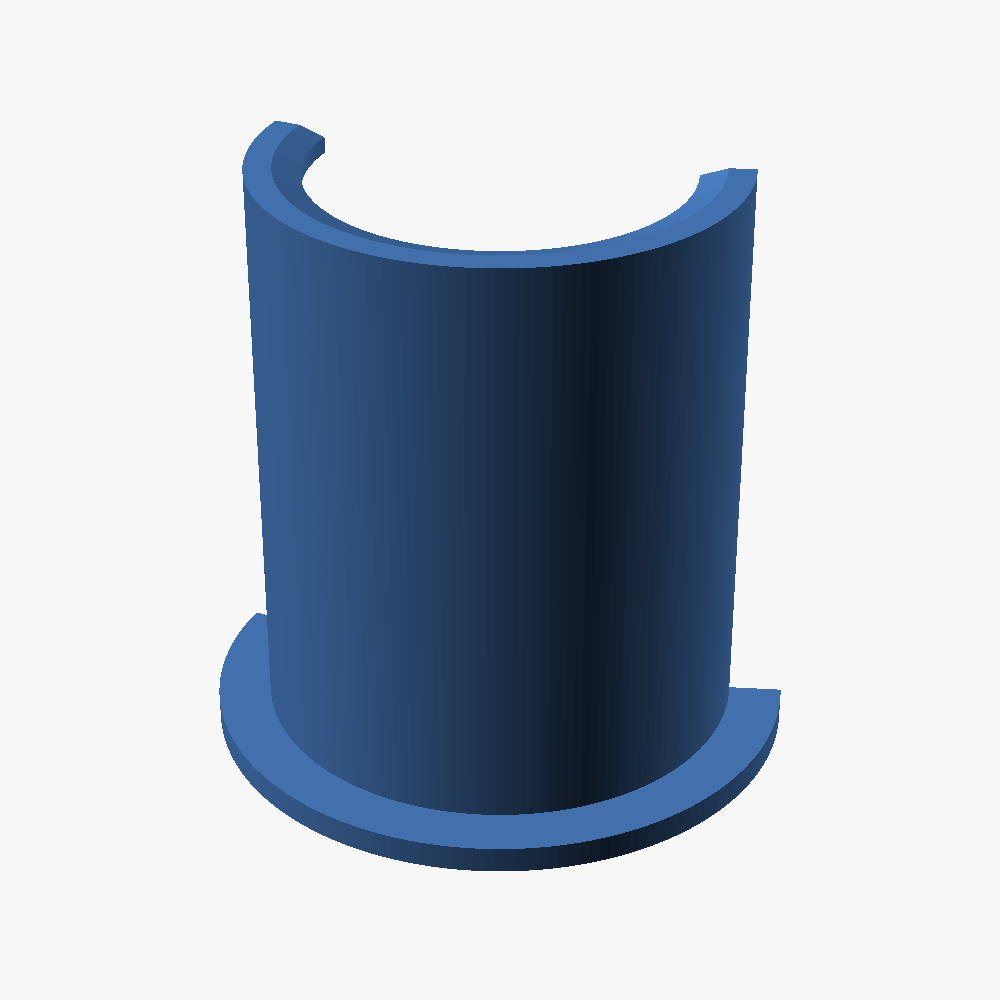
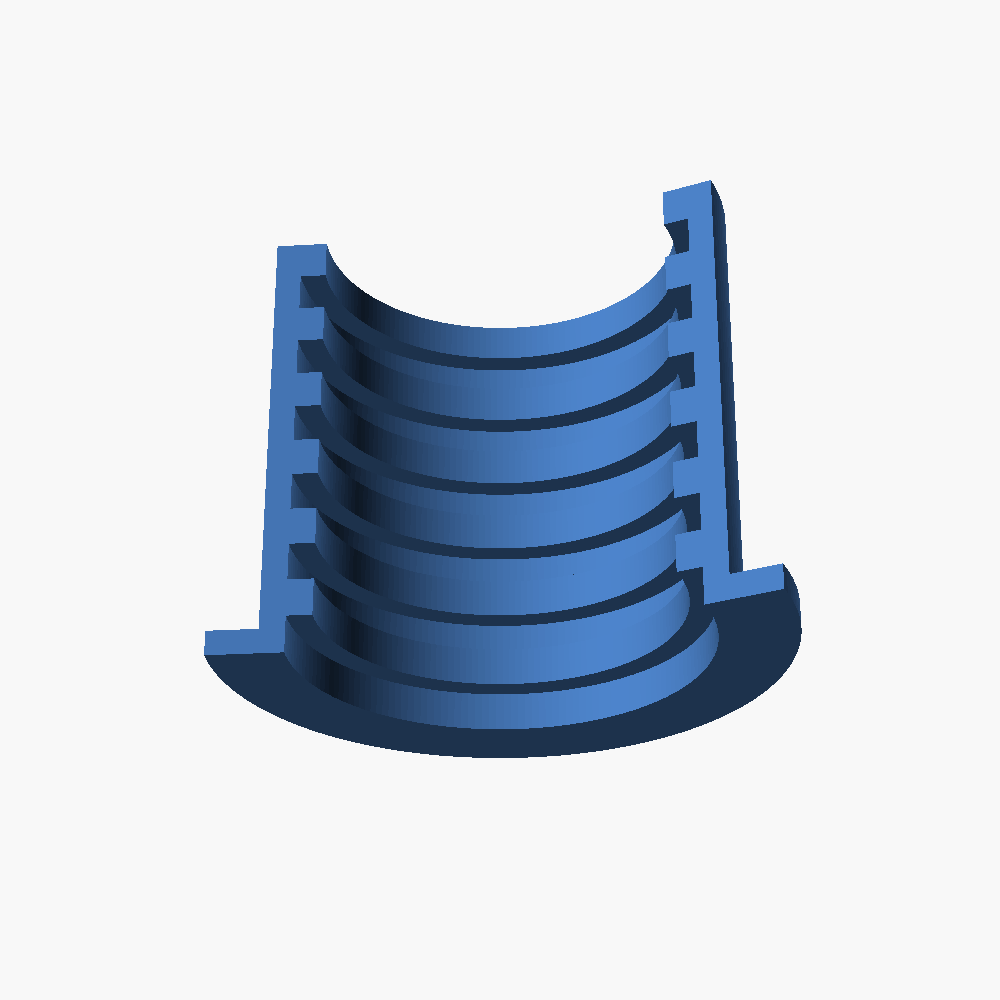
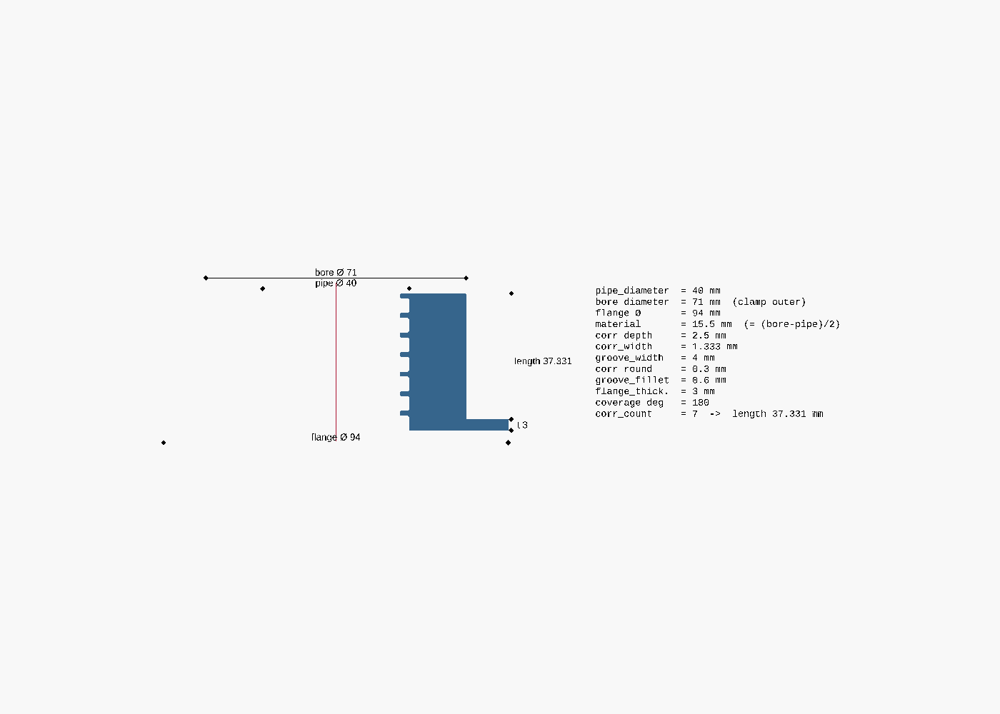
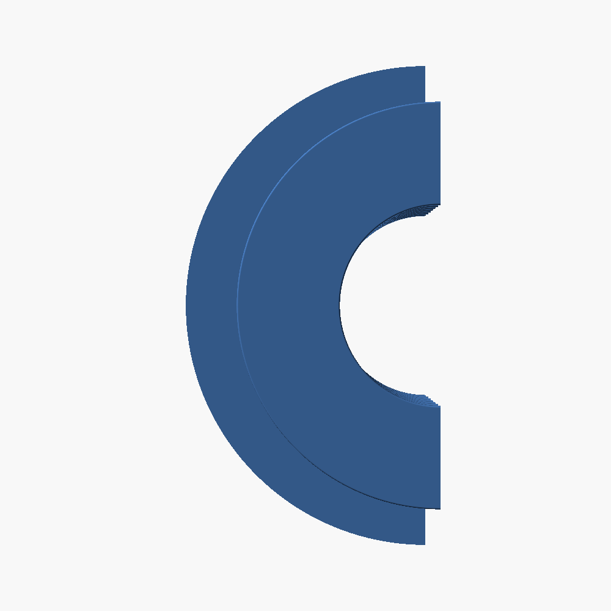
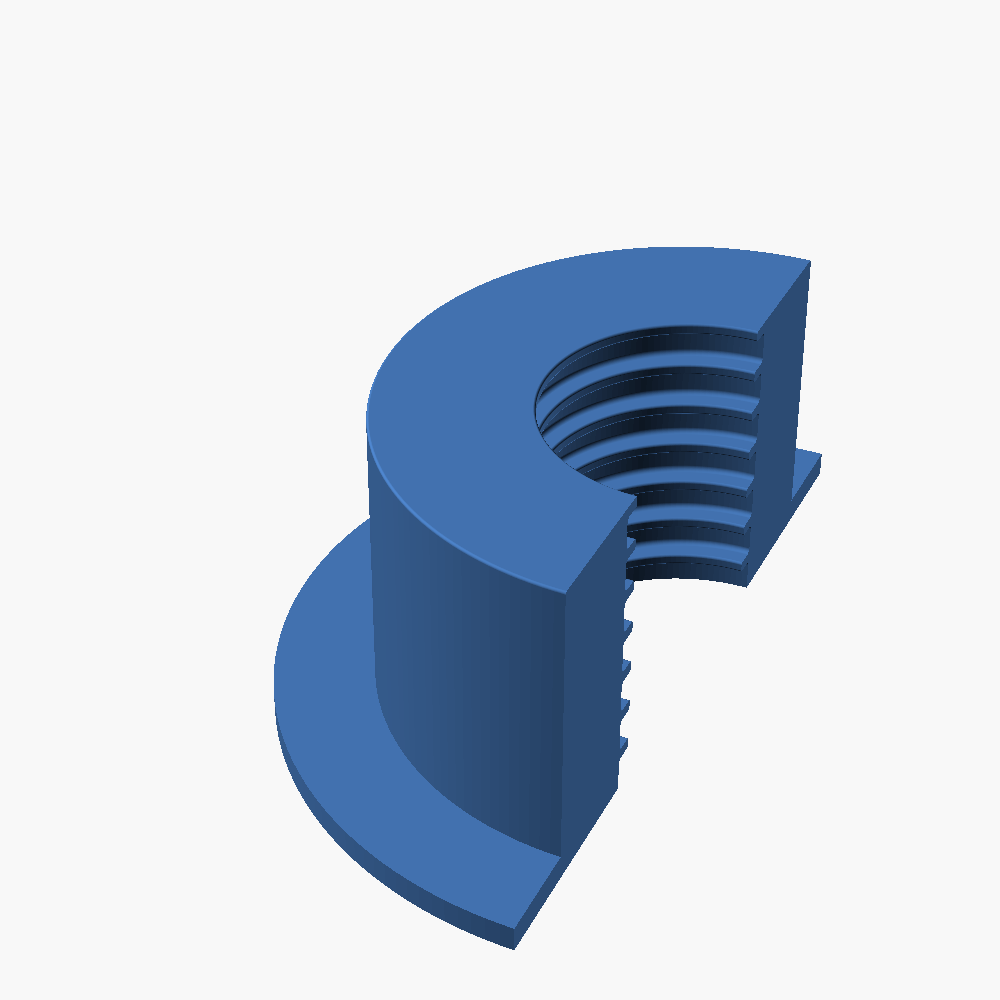

# Corrugated Pipe Clamp

A parametric, 3D-printable clamp that wraps **partially** around corrugated conduit
(electrical draw-in pipe). Internal circumferential teeth bite into the conduit's grooves
and **lock the pipe axially**, while a **flange** at one end is wider than the pipe so the
clamp + pipe cannot be pulled through a hole in a wall.

The whole model is defined in [`pipe_clamp.scad`](pipe_clamp.scad) using
[OpenSCAD](https://openscad.org/) — change the parameters at the top of the file and the
geometry updates automatically. All dimensions are in **millimetres**.

## Rendering example

All images below are rendered from the **default parameter values** in the
[parameter table](#parameters) further down — a "16 mm" conduit (crest Ø 15.8, valley Ø 13)
with 18 mm wall hole, 200° coverage, and a corrugation profile measured off a real pipe
(pitch 3.79 mm: 1.2 mm valley + 2.59 mm crest, 1.4 mm grip depth). Only the camera angle
differs between the 3D views.



This produces an arc covering ~200° of the pipe (open ~160° so it snaps on), with internal
circumferential grip teeth and a flange lip at one end. Computed result:

```
Available material (radial): 1.1 mm
Clamp body outer Ø: 18 mm     (= bore_diameter)
Flange Ø: 21.8 mm             (= pipe_diameter + 2·flange_overhang)
Length: 22.74 mm              (= corr_count · pitch = 6 · 3.79)
```

### Dimensioned drawing

A half-section with the sizes drawn straight onto it. Every value is generated from the
model's parameters by [`dimensions.scad`](dimensions.scad), so the drawing can never drift
from the geometry:



### More views

| Down the bore | Back (solid wrap) | Flange end |
|:---:|:---:|:---:|
|  |  |  |

All renders above (the 3D views and the dimensioned drawing) are regenerated by
[`render.sh`](render.sh). To export STLs for the standard conduit sizes, see
[Standard-size presets](#standard-size-presets) below.

## Parameters

| Parameter | Default | Meaning |
|---|---|---|
| `pipe_diameter` | `15.8` | Outer (crest) diameter of the corrugated conduit (mm) |
| `bore_diameter` | `18` | Hole the clamp passes through = clamp body outer Ø (mm) |
| `corr_depth` | `1.4` | How far the grip teeth bite into the conduit grooves (mm) |
| `corr_width` | `1.2` | Width of each grip tooth along the pipe axis (mm) |
| `groove_width` | `2.59` | Width of each recess (over a crest) along the axis (mm) |
| `corr_round` | `0.3` | Fillet radius on the convex tooth tips (mm); `0` = sharp tips |
| `groove_fillet` | `0.6` | Fillet radius in the concave groove bottoms (mm); eases the printed tooth-underside overhang. `0` = sharp corners |
| `corr_count` | `6` | Number of corrugation periods → sets the length |
| `coverage_deg` | `200` | Degrees of the pipe circumference covered |
| `flange_overhang` | `3` | How far the flange extends beyond the pipe width (mm) |
| `flange_thickness` | `1` | Flange thickness along the pipe axis (mm) |

### Sizing logic

You give the two diameters and the rest is **derived**:

- `pipe_diameter` is the conduit's outer (crest) diameter (e.g. 16 mm).
- `bore_diameter` is the hole the clamp must fit through — i.e. the clamp body's **outer
  diameter** (e.g. 18 mm).
- **Available material** (the smooth backing wall over the crests) =
  `(bore_diameter − pipe_diameter) / 2` (here 1 mm radial).
- The grip teeth bite `corr_depth` into the conduit's grooves (down to the valley), so the
  part is thicker at the teeth and thinnest (= available material) at the recesses.
- Real conduit crests and valleys are rounded/U-shaped rather than square, so two
  independent fillets soften the square-wave profile:
  - `corr_round` rounds the **convex tooth tips** (≤ half the smaller of
    `corr_width`/`groove_width`, and ≤ `corr_depth`).
  - `groove_fillet` rounds the **concave groove bottoms** — the downward-facing tooth
    undersides — which is the overhang that's hardest to 3D-print, so a larger radius here
    prints cleaner (≤ `corr_depth` and ≤ `groove_width`/2).
  Set either to `0` for sharp corners. Both limits are asserted in the model.
- Flange Ø = `pipe_diameter + 2·flange_overhang` (here 22 mm) — catches on the wall hole.
- Length = `corr_count · (corr_width + groove_width)` (always whole corrugation periods).
  The defaults were measured off a real "16 mm" conduit: crest Ø 15.8, valley Ø 13.0
  (→ `corr_depth` 1.4), 6 corrugations spanned 22.74 mm (pitch 3.79 mm = 1.2 valley + 2.59
  crest).

`bore_diameter` must be larger than `pipe_diameter` (asserted in the model). A coverage
above 180° gives a snap-fit grip onto the pipe.

## Conduit standard (IEC/EN 61386)

Electrical conduit is standardised by **IEC 61386** *"Conduit systems for cable
management"* (EN 61386 in Europe, NEK EN 61386 in Norway). Flexible/corrugated conduit is
covered by **part -22**. The **nominal size equals the outer (crest) diameter**, so set
`pipe_diameter` to a standard size:

| Nominal Ø (mm) | 16 | 20 | 25 | 32 | 40 | 50 | 63 |
|---|---|---|---|---|---|---|---|

16/20/25 mm are the common domestic sizes; the default model uses **16 mm**.

> ⚠️ **The standard fixes the nominal diameter, but *not* the corrugation depth or
> pitch** — these vary between makers and pipe types. Don't assume the defaults match your
> pipe; the defaults were measured off one specific "16 mm" conduit.

### How to measure your conduit

Use a caliper and set the parameters accordingly:

- `pipe_diameter` = the **crest** (outer) diameter.
- `corr_depth` = (crest Ø − valley Ø) / 2.
- pitch (`corr_width + groove_width`) = measure across **N** corrugations, divide by **N**.

## Usage

Open `pipe_clamp.scad` in the OpenSCAD GUI to tweak parameters live (they appear in the
Customizer panel, grouped via `/* [Group] */` tags) and press **F5** to preview.

### Export an STL from the command line

```sh
openscad -o pipe_clamp.stl pipe_clamp.scad
```

### Standard-size presets

Named parameter sets for the common IEC/EN 61386 conduit sizes live in
[`pipe_clamp.json`](pipe_clamp.json) (OpenSCAD Customizer presets — they appear in the
Customizer's preset dropdown in the GUI):

| Preset | `pipe_diameter` | `bore_diameter` | Notes |
|---|---|---|---|
| `conduit_16mm` | 16 | 18 | |
| `conduit_20mm` | 20 | 22 | |
| `conduit_25mm` | 25 | 27 | |
| `conduit_32mm` | 32 | 34 | |
| `conduit_40mm` | 40 | 42 | |
| `conduit_40mm_fittest` | 40 | 43 | 25° fit-test sliver, measured 40 mm pipe (3 mm deep teeth, no flange) |
| `conduit_40mm_mount` | 40 | 71 | 180° wall mount, measured 40 mm pipe; Ø71 bore, Ø94 flange (11.5 mm proud of the hole each side), 7 teeth, rounded grooves |

The plain `conduit_*` presets only set the two diameters (bore = pipe + 2 mm) and inherit
the default corrugation/flange values — **adjust `corr_depth` and pitch to your actual
pipe** (see [How to measure your conduit](#how-to-measure-your-conduit)). The `_fittest`
preset shows the fuller pattern: a measured 40 mm conduit (crest 40, valley 34, pitch
5.33 = 4 mm crest + 1.33 mm valley) rendered as a narrow 25° arc to print-test the tooth
fit cheaply before committing to a full clamp.

The `_mount` preset is a thick-walled wall fitting: Ø71 bore (15.5 mm of solid wall over
the pipe), a Ø94 flange that catches on the wall hole, and 7 teeth (≈37.3 mm long).
Coverage is **180°**, so two identical parts wrap the pipe a full 360° — one STL, no
left/right handing, and each half prints flat without support. A half-shell does not snap
on by itself; it needs its mate (or a cable tie) to close around the pipe.

The teeth bite `corr_depth` 2.5 mm into the conduit's 3 mm-deep grooves, leaving 0.5 mm of
clearance at the valley bottom so the part seats without being forced.



| Down the bore | 3/4 view | Flange end |
|:---:|:---:|:---:|
|  |  |  |

Render one preset from the command line:

```sh
openscad -o clamp_16mm.stl -p pipe_clamp.json -P conduit_16mm pipe_clamp.scad
```

Or build an STL for **every** preset into `stl/` at once:

```sh
./build.sh
```

### Re-render the README image

```sh
openscad -o images/pipe_clamp.png --imgsize=1000,1000 \
  --camera=0,0,9,55,0,25,95 --colorscheme=Tomorrow pipe_clamp.scad
```

## Requirements

- OpenSCAD (developed/verified with the 2026.04 snapshot/nightly build).
  - macOS: `brew install --cask openscad@snapshot`

## License

[MIT](LICENSE) © agjendem
